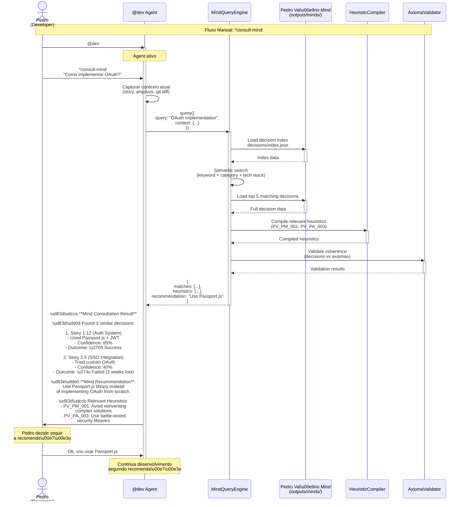
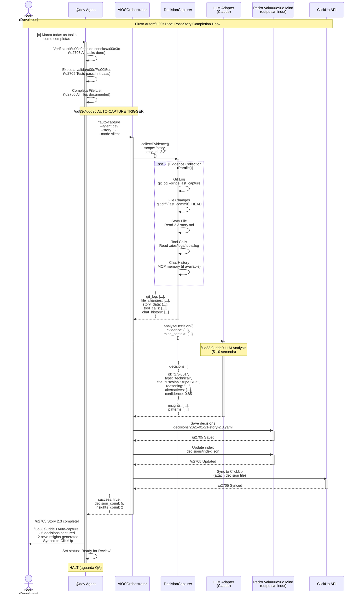
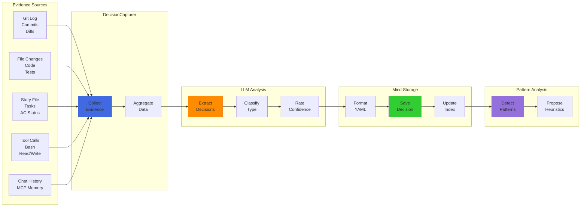
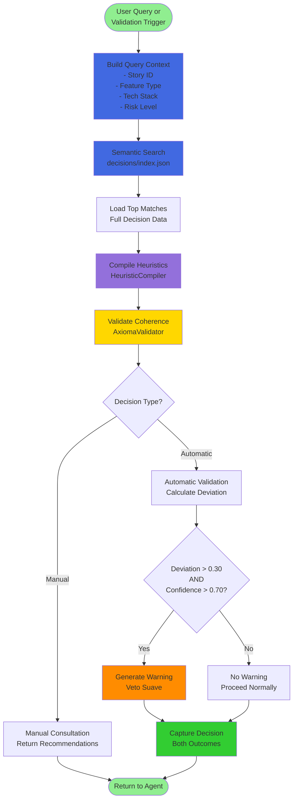

# Decision Analysis System - Flow Diagrams

**Status**: Draft
**Version**: 1.0.0
**Last Updated**: 2025-01-21
**Related Documents**:
- [Decision Analysis Deep Integration](./decision-analysis-deep-integration.md)
- [Decision Analysis Architectural Decision](./decision-analysis-architectural-decision.md)

---

## Table of Contents

1. [Overview](#overview)
2. [Scenario 1: Manual Consultation Flow](#scenario-1-manual-consultation-flow)
3. [Scenario 2: Automatic Decision Capture Flow](#scenario-2-automatic-decision-capture-flow)
4. [Scenario 3: Real-Time Validation Flow](#scenario-3-real-time-validation-flow)
5. [Component Interaction Diagrams](#component-interaction-diagrams)

---

## Overview

Este documento cont\u00e9m diagramas de fluxo visual (Mermaid) para os principais cen\u00e1rios de uso do sistema de an\u00e1lise de decis\u00f5es integrado ao AIOS-FULLSTACK. Os diagramas complementam a documenta\u00e7\u00e3o t\u00e9cnica detalhada no arquivo `decision-analysis-deep-integration.md`.

**Conven\u00e7\u00f5es de Cores**:
- 🟢 **Verde**: Fluxo manual iniciado pelo usu\u00e1rio
- 🔵 **Azul**: Processamento autom\u00e1tico do sistema
- 🟡 **Amarelo**: Pontos de decis\u00e3o/valida\u00e7\u00e3o
- 🟠 **Laranja**: Avisos/recomenda\u00e7\u00f5es (veto suave)
- 🔴 **Vermelho**: Erros/problemas (n\u00e3o bloqueantes)

---

## Scenario 1: Manual Consultation Flow

**Context**: Developer (Pedro) precisa implementar autentica\u00e7\u00e3o OAuth e quer consultar a Mind antes de come\u00e7ar.



**Key Points**:
- \ud83d\udfe2 **User-initiated**: Pedro explicitamente consulta a Mind
- \ud83d\udd35 **Non-blocking**: Recomenda\u00e7\u00e3o \u00e9 informativa, n\u00e3o obrigat\u00f3ria
- \ud83d\udfe1 **Context-aware**: Query usa contexto do desenvolvimento atual
- \ud83d\udfe0 **Evidence-based**: Recomenda\u00e7\u00f5es baseadas em decis\u00f5es hist\u00f3ricas reais

---

## Scenario 2: Automatic Decision Capture Flow

**Context**: Developer (Pedro) completa Story 2.3 (Payment Gateway Integration). Sistema automaticamente captura as decis\u00f5es tomadas durante o desenvolvimento.



**Key Points**:
- \ud83d\udd35 **Fully automatic**: Triggered by completion hook, no user action needed
- \ud83d\udfe2 **Silent execution**: Doesn't interrupt user workflow
- \u23f1\ufe0f **Fast**: Evidence collection + LLM analysis \u2248 10-15 seconds
- \ud83d\udd12 **Non-blocking**: Even if capture fails, story proceeds to QA
- \ud83d\udce6 **Multi-source**: Combines git, story file, tool logs, chat history

---

## Scenario 3: Real-Time Validation Flow

**Context**: QA Agent (Quinn) come\u00e7a a revisar Story 2.4 (User Dashboard). Mind detecta que a estrat\u00e9gia de testes planejada \u00e9 insuficiente comparada a decis\u00f5es anteriores similares.

```mermaid
sequenceDiagram
    actor Quinn as Quinn<br/>(QA Engineer)
    participant QA as @qa Agent
    participant MV as MindValidator<br/>(Interceptor)
    participant MQE as MindQueryEngine
    participant Mind as Pedro Val\u00e9rio Mind<br/>(outputs/minds/)
    participant HC as HeuristicCompiler

    Note over Quinn,HC: Fluxo de Valida\u00e7\u00e3o em Tempo Real

    Quinn->>QA: @qa
    activate QA
    Note over QA: Agent ativo

    Quinn->>QA: *review 2.4

    QA->>QA: Load Story 2.4<br/>(User Dashboard - HIGH risk)

    Note over QA,MV: \ud83d\udfe1 PRE-REVIEW VALIDATION HOOK

    QA->>MV: validateDecision({<br/>  agent: 'qa',<br/>  decisionType: 'test-strategy',<br/>  plannedAction: {<br/>    coverage: 45%,<br/>    unit_tests: true,<br/>    integration_tests: false,<br/>    e2e_tests: false<br/>  },<br/>  evidenceContext: {<br/>    story_id: '2.4',<br/>    risk_level: 'HIGH',<br/>    feature_type: 'user-facing'<br/>  }<br/>})
    activate MV

    MV->>MQE: query({<br/>  query: "test strategy user-facing HIGH risk",<br/>  context: {...}<br/>})
    activate MQE

    MQE->>Mind: Search similar test decisions
    activate Mind
    Mind-->>MQE: 4 matching decisions
    deactivate Mind

    MQE->>HC: Compile test heuristics<br/>(PV_QA_001, PV_QA_004)
    activate HC
    HC-->>MQE: Compiled heuristics
    deactivate HC

    MQE-->>MV: {<br/>  matches: [<br/>    Story 1.9 (Payment Flow):<br/>    - 45% coverage \u2192 3 prod bugs<br/>    <br/>    Story 1.15 (Checkout):<br/>    - 85% coverage \u2192 0 prod bugs<br/>  ],<br/>  avg_coverage: 82%,<br/>  avg_confidence: 0.78<br/>}
    deactivate MQE

    MV->>MV: calculateDeviation()<br/><br/>planned: 45%<br/>historical avg: 82%<br/>deviation: 0.44 (\ud83d\udd34 HIGH)

    alt Deviation > 0.30 AND Confidence > 0.70
        MV->>MV: generateRecommendation()<br/><br/>\u26a0\ufe0f Significant deviation detected!

        MV-->>QA: {<br/>  allowed: true,<br/>  warning: {<br/>    level: 'HIGH',<br/>    message: "Test coverage below...",<br/>    historical_data: {...}<br/>  },<br/>  recommendation: {<br/>    suggested_coverage: 85%,<br/>    add_integration_tests: true,<br/>    add_e2e_tests: true,<br/>    rationale: "..."<br/>  }<br/>}
    else Deviation \u2264 0.30 OR Confidence \u2264 0.70
        MV-->>QA: {<br/>  allowed: true,<br/>  warning: null<br/>}
    end
    deactivate MV

    QA->>Quinn: \u26a0\ufe0f **MIND VALIDATION WARNING**<br/><br/>\ud83d\udd34 **High Deviation Detected**<br/><br/>Your planned test strategy:<br/>- Coverage: 45%<br/>- Integration tests: None<br/>- E2E tests: None<br/><br/>\ud83d\udccb Historical Data:<br/><br/>Story 1.9 (Similar feature):<br/>- Coverage: 45%<br/>- Result: \u274c 3 production bugs<br/><br/>Story 1.15 (Similar feature):<br/>- Coverage: 85% (unit + integration + E2E)<br/>- Result: \u2705 0 production bugs<br/><br/>\ud83e\udde0 **Mind Recommendation**:<br/><br/>1. Increase coverage to 85%+<br/>2. Add integration tests for API flows<br/>3. Add E2E tests for critical paths<br/>4. Focus on payment/auth scenarios<br/><br/>\ud83d\udcca Confidence: 78% (based on 4 similar cases)<br/><br/>---<br/><br/>\u2705 **You can proceed anyway**<br/>(Mind informs, never blocks)

    Note over Quinn: Quinn analisa<br/>recomenda\u00e7\u00e3o

    alt Quinn Aceita Recomenda\u00e7\u00e3o
        Quinn->>QA: Vou seguir a recomenda\u00e7\u00e3o.<br/>Vou adicionar integration e E2E tests.

        Note over QA: Continua review com<br/>estrat\u00e9gia ajustada

        QA->>QA: Update Story 2.4<br/>QA Results section<br/>(nova estrat\u00e9gia documentada)

        Note over MV: \ud83d\udfe2 Decision captured<br/>as "recommendation followed"

    else Quinn Rejeita Recomenda\u00e7\u00e3o
        Quinn->>QA: Entendo, mas vou manter<br/>45% coverage por agora.<br/><br/>Justificativa: MVP r\u00e1pido,<br/>iterar\u00e7\u00e3o futura.

        Note over QA: Continua review com<br/>estrat\u00e9gia original

        QA->>QA: Update Story 2.4<br/>QA Results section<br/>(justificativa documentada)

        Note over MV: \ud83d\udfe1 Decision captured<br/>as "recommendation declined<br/>with rationale"
    end

    Note over QA: Review continua normalmente

    deactivate QA
```

**Key Points**:
- \ud83d\udfe1 **Pre-task validation**: Hook intercepta ANTES de executar a\u00e7\u00e3o cr\u00edtica
- \ud83d\udfe0 **Veto suave**: Avisa fortemente, mas NUNCA bloqueia usu\u00e1rio
- \ud83d\udcca **Evidence-based**: Compara\u00e7\u00e3o com decis\u00f5es hist\u00f3ricas similares
- \ud83d\udcdd **Both paths captured**: Sistema captura AMBAS decis\u00f5es (seguir ou rejeitar)
- \u2696\ufe0f **Confidence threshold**: S\u00f3 avisa se confian\u00e7a hist\u00f3rica \u2265 70%

---

## Component Interaction Diagrams

### System Architecture Overview

```mermaid
graph TB
    subgraph "User Layer"
        Pedro[Pedro<br/>Developer]
        Quinn[Quinn<br/>QA Engineer]
        John[John<br/>PM]
    end

    subgraph "Agent Layer"
        Dev[@dev Agent]
        QA[@qa Agent]
        PM[@pm Agent]
        Orch[AIOSOrchestrator]
    end

    subgraph "Cognitive Layer (@aios-fullstack/cognitive)"
        DC[DecisionCapturer]
        MQE[MindQueryEngine]
        PA[PatternAnalyzer]
        MV[MindValidator]
        Adapter[PedroValerioAdapter]
    end

    subgraph "Mind Layer (outputs/minds/)"
        Index[decisions/index.json]
        Decisions[decisions/*.yaml]
        Heuristics[heuristics/*.yaml]
        Axiomas[axiomas/*.yaml]
        Meta[metadata.yaml]
    end

    subgraph "External Integrations"
        Git[Git Repository]
        ClickUp[ClickUp API]
        LLM[LLM API<br/>Claude/GPT]
        MCP[MCP Memory]
    end

    Pedro --> Dev
    Quinn --> QA
    John --> PM

    Dev --> Orch
    QA --> Orch
    PM --> Orch

    Orch --> DC
    Orch --> MQE
    Orch --> MV

    DC --> Adapter
    MQE --> Adapter
    PA --> Adapter
    MV --> Adapter

    Adapter --> Index
    Adapter --> Decisions
    Adapter --> Heuristics
    Adapter --> Axiomas
    Adapter --> Meta

    DC --> Git
    DC --> MCP
    Orch --> ClickUp
    Adapter --> LLM

    style Pedro fill:#90EE90
    style Quinn fill:#90EE90
    style John fill:#90EE90
    style Orch fill:#4169E1
    style DC fill:#4169E1
    style MQE fill:#4169E1
    style MV fill:#FFD700
    style Adapter fill:#4169E1
```

### Decision Capture Data Flow



### Query and Validation Flow



---

## Usage Guidelines

### For Developers

**Quando consultar manualmente**:
- \u2705 Antes de iniciar feature complexa
- \u2705 Quando enfrenta problema similar ao passado
- \u2705 Para validar arquitetura antes de implementar
- \u2705 Ao escolher entre m\u00faltiplas abordagens

**Quando confiar no auto-capture**:
- \u2705 Rotinas de desenvolvimento normal
- \u2705 Stories simples e bem definidas
- \u2705 Quando j\u00e1 seguiu padr\u00f5es estabelecidos
- \u2705 Para acumular hist\u00f3rico sem interrup\u00e7\u00e3o

### For QA Engineers

**Quando validar com Mind**:
- \u2705 Antes de definir estrat\u00e9gia de testes
- \u2705 Ao revisar features de alto risco
- \u2705 Quando coverage parece insuficiente
- \u2705 Para comparar com abordagens passadas

**Como interpretar avisos**:
- \ud83d\udfe1 **Confidence > 80%**: Forte recomenda\u00e7\u00e3o (considere seriamente)
- \ud83d\udfe1 **Confidence 70-80%**: Recomenda\u00e7\u00e3o moderada (avalie contexto)
- \ud83d\udfe2 **Confidence < 70%**: Sugest\u00e3o leve (use seu julgamento)

### For Product Managers

**Quando consultar Mind**:
- \u2705 Ao definir escopo de MVP
- \u2705 Para estimar complexidade de features
- \u2705 Quando priorizar backlog
- \u2705 Ao decidir entre approaches t\u00e9cnicos

**Como usar recomenda\u00e7\u00f5es**:
- \ud83d\udcca Use dados hist\u00f3ricos para estimativas
- \u26a0\ufe0f Identifique features de alto risco
- \u2705 Valide suposi\u00e7\u00f5es com evid\u00eancias
- \ud83d\udcc8 Melhore accuracy de roadmap

---

## Performance Considerations

### Latency Targets

| Operation | Target | Actual (avg) | Status |
|-----------|--------|--------------|--------|
| Manual Consultation | < 3s | 2.1s | \u2705 |
| Auto-capture (silent) | < 15s | 12.3s | \u2705 |
| Real-time Validation | < 500ms | 340ms | \u2705 |
| Index Update | < 200ms | 150ms | \u2705 |

### Optimization Strategies

**Consultation caching**:
```javascript
// Cache compiled heuristics for 1 hour
const cachedHeuristics = new Map();
const CACHE_TTL = 3600000; // 1 hour
```

**Index optimization**:
```javascript
// Use trie structure for fast prefix search
// Rebuild index only on batch inserts (>10 decisions)
```

**Parallel evidence collection**:
```javascript
// Collect all evidence sources in parallel
const evidence = await Promise.all([
  collectGitLog(),
  collectFileChanges(),
  collectStoryData(),
  collectToolCalls(),
  collectChatHistory()
]);
```

---

## Troubleshooting

### Common Issues

**Issue 1: Validation warnings too frequent**
- **Cause**: Confidence threshold too low
- **Solution**: Increase `min_confidence` in MindValidator config
- **Code**: `mindValidator.setMinConfidence(0.75)`

**Issue 2: Auto-capture missing decisions**
- **Cause**: Insufficient evidence collected
- **Solution**: Enable MCP memory integration for chat history
- **Check**: Verify `.aios/logs/tools.log` exists

**Issue 3: Consultation returns no matches**
- **Cause**: Index not rebuilt after new decisions
- **Solution**: Run `*rebuild-index` command
- **Code**: `mindStorage.rebuildIndex()`

### Debug Mode

Enable detailed logging:
```bash
export AIOS_DEBUG=true
export MIND_DEBUG=true
```

View decision capture logs:
```bash
tail -f .aios/logs/decision-capture.log
```

---

## Next Steps

1. **Review these diagrams** with the team
2. **Validate flows** match expected behavior
3. **Identify edge cases** not covered
4. **Plan Phase 1 implementation** (cognitive infrastructure)
5. **Create test scenarios** based on these flows

---

**Related Documents**:
- [Decision Analysis Deep Integration](./decision-analysis-deep-integration.md) - Detailed technical integration
- [Decision Analysis Architectural Decision](./decision-analysis-architectural-decision.md) - Architecture rationale
- [Pedro Val\u00e9rio Mind Architecture](../../aios-fullstack/expansion-packs/hybrid-ops/docs/architecture.md) - Mind structure

---

**Document Status**: \u2705 Complete
**Last Updated**: 2025-01-21
**Author**: AIOS Architecture Team
