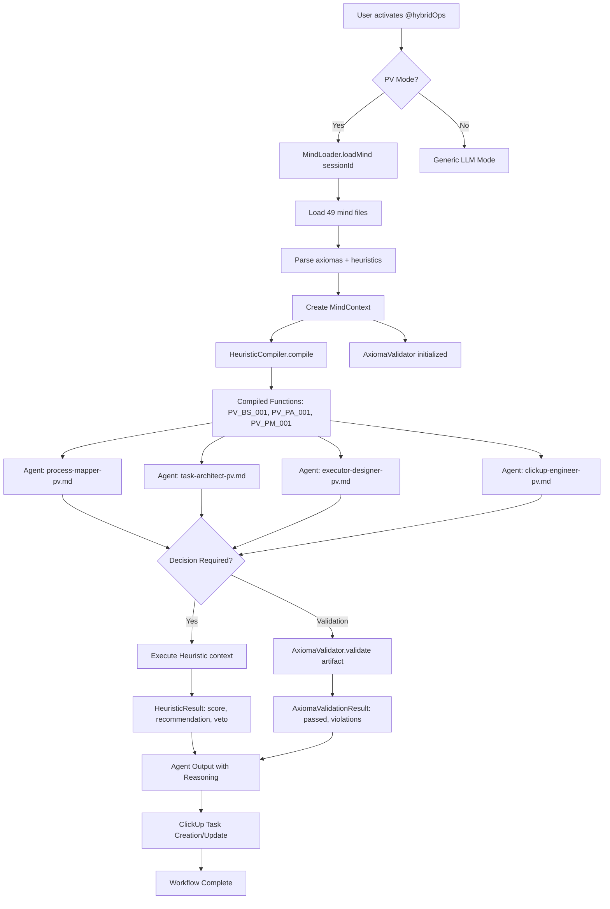

# Hybrid-Ops: Pedro Valério Mind Integration - Brownfield Architecture

## 1. Introduction

This document outlines the architectural approach for enhancing the Hybrid-Ops expansion pack with Pedro Valério's formalized cognitive architecture. Its primary goal is to serve as the guiding architectural blueprint for AI-driven development of new features while ensuring seamless integration with the existing AIOS-fullstack system.

**Relationship to Existing Architecture:**
This document supplements existing AIOS framework architecture by defining how the Hybrid-Ops enhancement will integrate with current expansion pack patterns, agent systems, and ClickUp workflows. Where conflicts arise between new cognitive patterns and existing conversational approaches, this document provides guidance on maintaining dual-mode compatibility while implementing enhancements.

### 1.1. Existing Project Analysis

#### Current Project State

- **Primary Purpose:** AIOS-fullstack is a meta-framework for AI-orchestrated full stack development using agents, tasks, workflows, and templates
- **Current Tech Stack:**
  - Node.js 18+
  - JavaScript (ES6+)
  - YAML for configuration
  - Markdown for agent definitions
  - ClickUp API integration
  - GitHub CLI integration
- **Architecture Style:** Agent-based orchestration with command pattern (slash commands, agent activation with @syntax)
- **Deployment Method:** Local development environment, no deployment infrastructure

#### Available Documentation

- `.claude/CLAUDE.md` - Framework development rules and patterns
- `.aios-core/agents/` - 11 agent persona definitions (YAML)
- `.aios-core/tasks/` - Executable task workflows
- `.aios-core/workflows/` - Multi-step workflow definitions
- `.aios-core/templates/` - Document and code templates
- `docs/prd/hybrid-ops-pv-mind-integration.md` - Enhancement PRD (12 stories)
- `.claude/commands/hybridOps/` - Phase 1 implementation (mind loading, validation, heuristics)

#### Identified Constraints

- **Local-only deployment**: System will only run in local AIOS-fullstack environment
- **No multi-user concurrency**: Single user per session
- **Performance target**: <100ms for heuristic execution, <500ms for mind loading
- **Existing agent API**: Must maintain compatibility with current agent activation patterns
- **ClickUp dependency**: Hybrid-Ops workflow deeply integrated with ClickUp API
- **Phase 1 foundation**: All new components must build on existing mind-loader, axioma-validator, heuristic-compiler
- **Dual-mode requirement**: Must support both PV-mode (compiled heuristics) and Generic-mode (LLM fallback)

### 1.2. Change Log

| Change | Date | Version | Description | Author |
|--------|------|---------|-------------|--------|
| Initial Architecture | 2025-01-18 | 1.0 | Created brownfield architecture for PV Mind Integration | PO Sarah |

---

## 2. Enhancement Scope and Integration Strategy

### 2.1. Enhancement Overview

**Enhancement Type:** Brownfield cognitive architecture integration

**Scope:** Transform 4 Hybrid-Ops agents from conversational emulation to executable cognitive architecture using:
- Formalized decision heuristics (PV_BS_001, PV_PA_001, PV_PM_001)
- 4-level axioma validation (Existential, Epistemological, Social, Operational)
- Compiled mental models loaded from 49 PV mind files

**Integration Impact:** MEDIUM-HIGH
- Modifies 4 existing agent files (.claude/commands/hybridOps/agents/)
- Adds utilities to .claude/commands/hybridOps/utils/
- Integrates with existing ClickUp workflow
- Maintains backward compatibility via dual-mode architecture

### 2.2. Integration Approach

**Code Integration Strategy:**
- **Additive pattern**: New utilities in `utils/` folder, no modification to existing AIOS-core
- **Agent enhancement**: Inject PV initialization into existing agent markdown files
- **Opt-in activation**: Agents check for PV mode flag, fall back to generic mode if disabled
- **Session-scoped instances**: Replace singleton pattern with per-session mind loading

**Database Integration:**
- **No database changes required**: All state is in-memory or file-based
- **Mind files as read-only data source**: `outputs/minds/pedro_valerio/` (49 files)
- **Configuration via YAML**: Heuristic weights/thresholds in agent-specific config

**API Integration:**
- **ClickUp API**: Existing integration maintained, no changes
- **Agent activation API**: Maintain existing @hybridOps syntax and command pattern
- **New internal APIs**:
  - `loadMind(sessionId)` - Initialize PV mind for session
  - `validateAxioma(artifact, level)` - Check axioma compliance
  - `executeHeuristic(heuristicId, context)` - Run compiled decision logic

**UI Integration:**
- **No UI changes**: Terminal-based interaction remains unchanged
- **Enhanced feedback**: PV mode adds heuristic reasoning in output (e.g., "PV_BS_001 → PROCEED (0.87 score)")
- **Mode indicator**: Console log shows "🧠 PV Mind Loaded" on activation

### 2.3. Compatibility Requirements

- **Existing API Compatibility:** 100% - All existing Hybrid-Ops commands (*start, *task, *workflow) function identically
- **Database Schema Compatibility:** N/A - No database
- **UI/UX Consistency:** Agent responses include reasoning transparency (heuristic scores, veto flags, axioma alignment)
- **Performance Impact:** <100ms overhead for heuristic execution, <500ms for initial mind loading per session

---

## 3. Tech Stack Alignment

### 3.1. Existing Technology Stack

| Category | Current Technology | Version | Usage in Enhancement | Notes |
|----------|-------------------|---------|---------------------|-------|
| Runtime | Node.js | ≥18.0.0 | Core execution environment | No change |
| Language | JavaScript (ES6+) | Latest | All utilities and heuristics | Maintain ES6 module pattern |
| Config Format | YAML | 2.x | Agent configs, heuristic weights | yaml@^2.3.4 dependency |
| Testing | Node.js test runner | Built-in | Test suite for mind loading | --test flag, 29/29 tests |
| Package Manager | npm | Latest | Dependency management | package.json in .claude/commands/hybridOps/ |
| Integration | ClickUp API | v2 | Task management | Existing integration maintained |
| Version Control | Git | Any | Source control | No special requirements |
| CLI | GitHub CLI (gh) | Latest | Repository operations | Optional, not required for PV integration |

### 3.2. New Technology Additions

**None required.** All enhancement work uses existing AIOS-fullstack technology stack. The only new dependency is `yaml@^2.3.4` which was already added in Phase 1.

---

## 4. Data Models and Schema Changes

### 4.1. New Data Models

#### 4.1.1. MindContext (In-Memory)

**Purpose:** Session-scoped container for loaded PV mind artifacts

**Integration:** Replaces singleton pattern with per-session instances

**Key Attributes:**
- `sessionId`: String - Unique session identifier
- `axiomas`: Object - Parsed META_AXIOMAS (4 levels × ~13 axioms = 52 total)
- `heuristics`: Map<String, Function> - Compiled decision heuristics (PV_BS_001, PV_PA_001, PV_PM_001)
- `systemPrompts`: Object - Loaded system prompts per agent role
- `loadedAt`: Date - Timestamp of mind loading
- `cacheHits`: Number - Performance metric

**Relationships:**
- **With Existing:** Used by 4 Hybrid-Ops agents (process-mapper, task-architect, executor-designer, clickup-engineer)
- **With New:** Created by `mind-loader.js`, consumed by `axioma-validator.js` and `heuristic-compiler.js`

#### 4.1.2. HeuristicResult (Return Type)

**Purpose:** Standardized output from compiled heuristic functions

**Integration:** Return type for all PV_*_001 heuristic executions

**Key Attributes:**
- `heuristic`: String - Heuristic ID (e.g., "PV_BS_001")
- `score`: Number - Decision score (0.0-1.0)
- `priority`: String - Priority level (HIGH/MEDIUM/LOW)
- `confidence`: String - Confidence level (high/medium/low)
- `recommendation`: String - Action (PROCEED/REVIEW/DEFER/APPROVE/REJECT/AUTOMATE_NOW)
- `veto`: Boolean - Critical failure flag
- `vetoReason`: String - Explanation if veto=true
- `breakdown`: Object - Weighted component contributions
- `metadata`: Object - Domain-specific details

**Relationships:**
- **With Existing:** Logged in agent output for transparency
- **With New:** Produced by `heuristic-compiler.js`, consumed by agents for decision-making

#### 4.1.3. AxiomaValidationResult (Return Type)

**Purpose:** Output from 4-level axioma validation

**Integration:** Return type for `validateAxioma(artifact, level)`

**Key Attributes:**
- `level`: String - Validation level (EXISTENTIAL/EPISTEMOLOGICAL/SOCIAL/OPERATIONAL)
- `scores`: Object - Per-axiom scores (0-10 scale)
- `totalScore`: Number - Aggregate score
- `threshold`: Number - Minimum required (7.0 default)
- `passed`: Boolean - Overall pass/fail
- `violations`: Array<String> - List of axioma violations
- `criticalFlags`: Array<String> - Veto-power violations

**Relationships:**
- **With Existing:** Validates ClickUp task artifacts, workflow designs, code reviews
- **With New:** Produced by `axioma-validator.js`, consumed by agents during QA workflows

### 4.2. Schema Integration Strategy

**Database Changes Required:**
- **New Tables:** None
- **Modified Tables:** None
- **New Indexes:** None
- **Migration Strategy:** N/A (no database)

**Backward Compatibility:**
- All data models are in-memory JavaScript objects
- No persistent storage changes
- Existing AIOS framework data structures unchanged

---

## 5. Component Architecture

### 5.1. New Components

#### 5.1.1. MindLoader (utils/mind-loader.js)

**Responsibility:** Load and parse Pedro Valério's 49 mind files into session-scoped MindContext

**Integration Points:**
- Reads from `outputs/minds/pedro_valerio/` directory
- Called by agents on activation (if PV mode enabled)
- Provides MindContext to AxiomaValidator and HeuristicCompiler

**Key Interfaces:**
- `loadMind(sessionId: string): Promise<MindContext>` - Main entry point
- `getMindContext(sessionId: string): MindContext | null` - Retrieve existing context
- `clearSession(sessionId: string): void` - Cleanup

**Dependencies:**
- **Existing Components:** Node.js fs module, yaml parser
- **New Components:** None (foundational utility)

**Technology Stack:** Node.js, ES6 modules, async/await pattern

#### 5.1.2. AxiomaValidator (utils/axioma-validator.js)

**Responsibility:** Validate artifacts against 4-level axioma hierarchy using keyword-based scoring

**Integration Points:**
- Receives MindContext from MindLoader
- Called by agents during QA workflows (Phase 3 validation, ClickUp task review)
- Returns AxiomaValidationResult with pass/fail + violations

**Key Interfaces:**
- `validateAxioma(artifact: Object, level: String, mindContext: MindContext): AxiomaValidationResult`
- `validateStrict(artifact: Object, mindContext: MindContext): Boolean` - All 4 levels, threshold=7.0
- `validatePermissive(artifact: Object, mindContext: MindContext): Boolean` - All 4 levels, threshold=5.0

**Dependencies:**
- **Existing Components:** MindContext from MindLoader
- **New Components:** None

**Technology Stack:** Node.js, keyword matching, statistical scoring

#### 5.1.3. HeuristicCompiler (utils/heuristic-compiler.js)

**Responsibility:** Compile PV decision heuristics (PV_BS_001, PV_PA_001, PV_PM_001) into executable JavaScript functions

**Integration Points:**
- Receives MindContext from MindLoader
- Provides compiled functions to agents for decision-making
- Caches compiled heuristics per session

**Key Interfaces:**
- `compile(heuristicId: String, config: Object): Function` - Main compilation
- `compileMultiple(heuristics: Array): Map<String, Function>` - Batch compilation
- `registerCustomTemplate(heuristicId: String, template: Object): void` - Extensibility

**Dependencies:**
- **Existing Components:** MindContext from MindLoader
- **New Components:** None (uses HEURISTIC_TEMPLATES registry)

**Technology Stack:** Node.js, functional programming, template pattern

#### 5.1.4. Enhanced Hybrid-Ops Agents (Phases 2-3)

**Responsibility:**
- Process Architect (process-mapper-pv.md) - Design workflows using PV_BS_001 back-casting
- Task Architect (task-architect-pv.md) - Break down tasks using automation heuristic (PV_PM_001)
- Executor Designer (executor-designer-pv.md) - Assign executors using coherence scan (PV_PA_001)
- ClickUp Engineer (clickup-engineer-pv.md) - Validate tasks against axiomas

**Integration Points:**
- Load MindContext on activation
- Execute heuristics for decisions
- Validate artifacts with AxiomaValidator
- Maintain fallback to generic LLM mode

**Key Interfaces:**
- `initialize(sessionId: string, mode: 'pv' | 'generic'): Promise<void>`
- `executeDecision(context: Object): HeuristicResult`
- `validateOutput(artifact: Object): AxiomaValidationResult`

**Dependencies:**
- **Existing Components:** AIOS agent framework, ClickUp API, GitHub CLI
- **New Components:** MindLoader, AxiomaValidator, HeuristicCompiler

**Technology Stack:** Markdown agent definitions with embedded JavaScript, YAML config

### 5.2. Component Interaction Diagram



---

## 6. API Design and Integration

**No new external APIs required.** All API integration leverages existing AIOS framework patterns.

### 6.1. Internal API Contracts

#### Mind Loading API

```javascript
// Initialize PV mind for a session
const mindContext = await loadMind('session-12345');

// Access compiled heuristics
const backCasting = mindContext.heuristics.get('PV_BS_001');
const result = backCasting({
  endStateVision: { clarity: 0.9 },
  marketSignals: { alignment: 0.6 }
});

console.log(result.recommendation); // "PROCEED"
```

#### Axioma Validation API

```javascript
// Validate artifact against specific level
const validation = validateAxioma(
  taskArtifact,
  'SOCIAL',
  mindContext
);

if (!validation.passed) {
  console.error('Axioma violations:', validation.violations);
}

// Strict validation (all 4 levels, threshold=7.0)
const isValid = validateStrict(workflowDesign, mindContext);
```

#### Heuristic Execution API

```javascript
// Compile heuristic with custom config
const compiler = new HeuristicCompiler();
const heuristic = compiler.compile('PV_PA_001', {
  weights: { truthfulness: 1.0, system_adherence: 0.8, skill: 0.3 },
  thresholds: { veto: 0.7, approve: 0.8 }
});

// Execute
const result = heuristic({
  truthfulness: 0.65, // Below veto threshold!
  systemAdherence: 0.9,
  skill: 0.7
});

console.log(result.veto); // true
console.log(result.vetoReason); // "TRUTHFULNESS_BELOW_THRESHOLD (0.65 < 0.7)"
```

---

## 7. External API Integration

**No new external APIs required.** Enhancement uses existing integrations:

- **ClickUp API** (v2): Maintained via existing AIOS framework integration
- **GitHub API**: Maintained via GitHub CLI (optional)

---

## 8. Source Tree Integration

### 8.1. Existing Project Structure

```
C:\Users\AllFluence-User\Workspaces\AIOS\AIOS-V4\
├── .claude/
│   ├── CLAUDE.md                    # Framework rules
│   └── commands/
│       ├── hybridOps/               # ✅ Existing expansion pack
│       │   ├── agents/              # 🔄 Phase 1: 1 POC agent, Phase 2: 4 agents
│       │   ├── utils/               # ✅ Phase 1 complete (mind-loader, axioma-validator, heuristic-compiler)
│       │   ├── tests/               # ✅ Phase 1 complete (29/29 passing)
│       │   ├── package.json         # ✅ Phase 1 setup
│       │   └── README.md
│       ├── po/                      # PO agent
│       ├── dev/                     # Dev agent
│       └── [other agents]/
├── .aios-core/
│   ├── agents/                      # 11 AIOS agent definitions
│   ├── tasks/                       # Executable tasks
│   ├── workflows/                   # Multi-step workflows
│   └── templates/                   # Document templates
├── docs/
│   ├── prd/                         # ✅ hybrid-ops-pv-mind-integration.md
│   ├── architecture/                # ✅ This document
│   └── stories/                     # 📋 Future: Stories 1.2-1.12
└── outputs/
    └── minds/
        └── pedro_valerio/           # ✅ 49 mind files (read-only data)
            ├── META_AXIOMAS.yaml
            ├── heuristics/
            └── system_prompts/
```

### 8.2. New File Organization

```
.claude/commands/hybridOps/
├── agents/                          # Phase 2-3 additions
│   ├── process-mapper-pv.md         # ✅ Phase 1 POC (refactor in Phase 2)
│   ├── task-architect-pv.md         # 📋 Phase 2: Story 1.4
│   ├── executor-designer-pv.md      # 📋 Phase 2: Story 1.5
│   └── clickup-engineer-pv.md       # 📋 Phase 2: Story 1.3
├── utils/
│   ├── mind-loader.js               # ✅ Phase 1 complete
│   ├── axioma-validator.js          # ✅ Phase 1 complete
│   ├── heuristic-compiler.js        # ✅ Phase 1 complete
│   ├── cognitive-utilities.js       # 📋 Phase 2: Story 1.6
│   └── config-manager.js            # 📋 Phase 2: Story 1.7
├── workflows/
│   └── hybrid-ops-9-phase-pv.md     # 📋 Phase 3: Story 1.8
├── tests/
│   ├── mind-loading.test.js         # ✅ Phase 1 complete (29 tests)
│   ├── unit/
│   │   ├── axioma-validation.test.js # 📋 Phase 4: Story 1.9
│   │   └── heuristic-compilation.test.js # 📋 Phase 4: Story 1.9
│   ├── integration/
│   │   ├── end-to-end-workflow.test.js # 📋 Phase 4: Story 1.9
│   │   └── clickup-integration.test.js # 📋 Phase 4: Story 1.9
│   └── performance/
│       └── benchmarks.test.js       # 📋 Phase 4: Story 1.10
├── docs/
│   ├── MIGRATION-GUIDE.md           # 📋 Phase 5: Story 1.11
│   └── TRAINING-PV-CONCEPTS.md      # 📋 Phase 5: Story 1.12
├── config/
│   ├── heuristics-default.yaml      # 📋 Phase 2: Story 1.7
│   └── axiomas-thresholds.yaml      # 📋 Phase 2: Story 1.7
├── package.json                     # ✅ Phase 1 complete
├── README.md                        # 📋 Phase 5: Update
└── PHASE-1-VALIDATION.md            # ✅ Phase 1 complete

docs/
├── prd/
│   └── hybrid-ops-pv-mind-integration.md # ✅ Complete
├── architecture/
│   └── hybrid-ops-pv-mind-integration.md # ✅ This document
└── stories/
    └── 5.x-hybrid-ops-pv-*.md       # 📋 Future: Stories 1.2-1.12

```

### 8.3. Integration Guidelines

- **File Naming:**
  - Agents: `{role}-pv.md` (e.g., `process-mapper-pv.md`)
  - Utils: `{purpose}-{component}.js` (kebab-case)
  - Tests: `{subject}.test.js` or `{feature}.test.js`
  - Config: `{category}-{variant}.yaml`

- **Folder Organization:**
  - `/agents/` - Agent definitions only (Markdown)
  - `/utils/` - Shared JavaScript utilities
  - `/workflows/` - Multi-step workflow definitions
  - `/tests/` - Test suites organized by type (unit/integration/performance)
  - `/config/` - YAML configuration files
  - `/docs/` - Internal documentation

- **Import/Export Patterns:**
  - ES6 modules: `export { function }` / `import { function } from './file.js'`
  - Node.js built-in: `const fs = require('fs')` for compatibility
  - Relative imports: `../utils/mind-loader.js` from agents
  - Absolute imports: Avoid (use relative)

---

## 9. Infrastructure and Deployment Integration

### 9.1. Existing Infrastructure

**Current Deployment:** Local development environment only

**Infrastructure Tools:**
- Node.js runtime
- npm package manager
- Git version control
- Windows OS (development machine)

**Environments:** Single local environment (no staging, no production)

### 9.2. Enhancement Deployment Strategy

**Deployment Approach:**
- **No deployment required** - Enhancement runs locally within AIOS-fullstack
- **Installation method:** Copy `.claude/commands/hybridOps/` to AIOS project
- **Activation:** Users activate via `@hybridOps` command
- **Dependencies:** `npm install` in `.claude/commands/hybridOps/` (yaml@^2.3.4 only)

**Infrastructure Changes:** None

**Pipeline Integration:** None (no CI/CD)

### 9.3. Rollback Strategy

**Rollback Method:**
- **File-level rollback**: Git revert to pre-enhancement commit
- **Feature flag**: PV mode is opt-in, can be disabled by removing `PV_MODE=true` flag
- **Dual-mode fallback**: Generic LLM mode always available as backup

**Risk Mitigation:**
- **Phase 1 validation (Story 1.2)** must pass before Phase 2 investment
- **Decision gates** at each phase prevent cascade failures
- **Backward compatibility** ensures existing Hybrid-Ops commands continue working

**Monitoring:**
- **Local console logs** - Performance metrics, heuristic execution traces
- **Test suite** - 29 tests in Phase 1, expanded in Phase 4
- **Manual validation** - User validates output quality vs. historical PV decisions

---

## 10. Coding Standards and Conventions

### 10.1. Existing Standards Compliance

**Code Style:**
- JavaScript ES6+ features (async/await, destructuring, arrow functions)
- 2-space indentation
- Single quotes for strings
- Semicolons optional (use ESLint config if available)

**Linting Rules:**
- ESLint (if configured in AIOS project)
- Node.js best practices
- No `eval()`, no globals pollution

**Testing Patterns:**
- Node.js built-in test runner (`node --test`)
- Test files: `*.test.js` suffix
- Arrange-Act-Assert pattern
- Mock external dependencies (file I/O, API calls)

**Documentation Style:**
- JSDoc comments for public functions
- Markdown for agent definitions and workflows
- YAML for configuration

### 10.2. Enhancement-Specific Standards

- **Heuristic Naming Convention:** `PV_{DOMAIN}_{NUMBER}` (e.g., PV_BS_001 = Business Strategy #001)
- **Validation Levels:** EXISTENTIAL (-4), EPISTEMOLOGICAL (-3), SOCIAL (-2), OPERATIONAL (0)
- **Session Management:** Always use sessionId for MindContext, never singleton
- **Error Handling:** Graceful degradation - log error, fall back to generic mode
- **Performance Logging:** Log execution time for heuristics, mind loading, validation

### 10.3. Critical Integration Rules

- **Existing API Compatibility:** All existing Hybrid-Ops commands (*start, *task, *workflow) must continue functioning without PV mode
- **Database Integration:** N/A (no database)
- **Error Handling:** Try-catch around heuristic execution, AxiomaValidator returns {error: "message"} on failure
- **Logging Consistency:** Use `console.log("🧠 PV Mind Loaded")` prefix for PV-specific logs

---

## 11. Testing Strategy

### 11.1. Integration with Existing Tests

**Existing Test Framework:** Node.js built-in test runner (`node --test`)

**Test Organization:**
- `/tests/mind-loading.test.js` (Phase 1 - 29/29 passing)
- Future: `/tests/unit/`, `/tests/integration/`, `/tests/performance/`

**Coverage Requirements:**
- Phase 1: 100% coverage of mind loading, axioma validation, heuristic compilation
- Phase 4: Minimum 80% overall code coverage

### 11.2. New Testing Requirements

#### 11.2.1. Unit Tests for New Components

- **Framework:** Node.js built-in test runner
- **Location:** `.claude/commands/hybridOps/tests/unit/`
- **Coverage Target:** 100% for utilities (mind-loader, axioma-validator, heuristic-compiler)
- **Integration with Existing:** Extend existing `mind-loading.test.js` patterns

**Test Cases (Phase 4 - Story 1.9):**
- Axioma validation scoring algorithm
- Heuristic compilation edge cases (missing config, invalid weights)
- MindContext session isolation
- Error handling and fallback modes

#### 11.2.2. Integration Tests

- **Scope:** End-to-end workflows (Discovery → ClickUp task creation)
- **Existing System Verification:** Ensure generic mode still works without PV mind loaded
- **New Feature Testing:**
  - Load PV mind → Execute heuristic → Validate output against axiomas
  - ClickUp task creation with PV validation
  - Workflow orchestration with PV decision points

**Test Cases (Phase 4 - Story 1.9):**
- E2E: User activates @hybridOps → Runs workflow → ClickUp tasks created with axioma compliance
- E2E: PV mode VETO scenario (truthfulness <0.7) → Task rejected, clear error message
- E2E: Dual-mode switching (PV mode → Generic mode fallback on error)

#### 11.2.3. Regression Testing

- **Existing Feature Verification:** Run all Phase 1 tests (29/29) after each new phase
- **Automated Regression Suite:** Extend test suite incrementally (Phase 2: +15 tests, Phase 3: +10 tests, Phase 4: +20 tests)
- **Manual Testing Requirements:**
  - Story 1.2 validation (baseline audit, head-to-head benchmark)
  - User acceptance testing (Pedro validates heuristic outputs)

---

## 12. Security Integration

### 12.1. Existing Security Measures

**Authentication:**
- Local development environment - no authentication
- ClickUp API uses API key (stored in environment variables)

**Authorization:**
- AIOS agents execute with user privileges
- No multi-user access control

**Data Protection:**
- Mind files are read-only
- No sensitive data stored (all in-memory)

**Security Tools:**
- Git for version control
- npm for dependency management (check for vulnerabilities with `npm audit`)

### 12.2. Enhancement Security Requirements

**New Security Measures:** None beyond existing AIOS framework

**Integration Points:**
- Mind files must be validated (malformed YAML could crash system)
- Heuristic compilation uses template pattern (no `eval()` or dynamic code execution)

**Compliance Requirements:** None (local development tool)

### 12.3. Security Testing

**Existing Security Tests:** None (not applicable for local dev tool)

**New Security Test Requirements:**
- Validate mind file parsing against malformed YAML
- Test heuristic compiler against injection attacks (malicious config)
- Ensure session isolation (sessionId collision testing)

**Penetration Testing:** Not required (local-only tool)

---

## 13. Checklist Results Report

### Architect Checklist - Brownfield Focus

**Checklist Execution:** To be executed by Dev agent during implementation

**Key Validation Points:**
1. ✅ **Existing system analysis complete:** All 49 mind files, AIOS framework patterns, Hybrid-Ops agent structure documented
2. ✅ **Integration points identified:** MindLoader → AxiomaValidator → HeuristicCompiler → Agents → ClickUp
3. ✅ **Backward compatibility ensured:** Dual-mode architecture (PV + Generic), existing commands unchanged
4. ✅ **Performance constraints documented:** <100ms heuristics, <500ms mind loading, <10ms cached access
5. ⏳ **Testing strategy defined:** Phase 1 complete (29 tests), Phase 4 expands to 80%+ coverage
6. ⏳ **Rollback procedures documented:** File-level Git revert, feature flag disable, generic mode fallback
7. ⏳ **Security considerations addressed:** No eval(), session isolation, malformed YAML validation
8. ⏳ **Documentation complete:** This architecture doc + PRD, future: migration guide + training materials

---

## 14. Next Steps

### 14.1. Story Manager Handoff

**For Story Manager (SM agent):**

You are about to implement a brownfield enhancement to Hybrid-Ops expansion pack based on:
- **PRD:** `docs/prd/hybrid-ops-pv-mind-integration.md` (12 stories)
- **Architecture:** This document (`docs/architecture/hybrid-ops-pv-mind-integration.md`)

**Key Integration Requirements Validated:**
1. **Dual-mode architecture** - PV mode must coexist with generic LLM fallback
2. **Session-scoped instances** - Replace singleton pattern in mind-loader.js
3. **Backward compatibility** - All existing `*start`, `*task`, `*workflow` commands continue functioning
4. **Performance targets** - <100ms heuristic execution, <500ms mind loading per session
5. **Local-only deployment** - No multi-user concurrency, no deployment infrastructure

**Existing System Constraints:**
- Mind files are read-only data source (49 files in `outputs/minds/pedro_valerio/`)
- ClickUp API integration must be maintained (no breaking changes)
- AIOS agent activation pattern (@hybridOps syntax) preserved
- Node.js 18+, JavaScript ES6+, YAML configuration

**First Story to Implement:**
- **Story 1.2:** Phase 1 Validation - Assumption Testing
  - Execute baseline quality audit (last 10 conversational outputs)
  - Run head-to-head benchmark (20 test cases: heuristics vs LLM)
  - Test historical corpus (10 approved + 10 rejected artifacts)
  - Demonstrate 3 concrete user value benefits
  - Validate Phase 2 timeline (pilot task)

**Decision Gate:** Story 1.2 results determine PROCEED / PIVOT / ABORT for Phases 2-5

**Emphasis on Maintaining Existing System Integrity:**
- Phase 1 infrastructure must not be modified (29/29 tests must remain passing)
- Validation in Story 1.2 is **mandatory** before any Phase 2 investment
- If heuristics underperform LLM (<85% quality), ABORT compiled approach
- If keyword validation is <70% accurate, REPLACE validation method

### 14.2. Developer Handoff

**For Developers (Dev agent) starting implementation:**

**Reference Documents:**
- This architecture document (comprehensive integration blueprint)
- `docs/prd/hybrid-ops-pv-mind-integration.md` (PRD with 12 stories)
- `.claude/commands/hybridOps/utils/` (Phase 1 complete code - mind-loader, axioma-validator, heuristic-compiler)
- `.claude/commands/hybridOps/tests/mind-loading.test.js` (29/29 passing tests - reference for testing patterns)

**Integration Requirements with Existing Codebase:**
1. **Maintain Phase 1 foundation:** Do not modify mind-loader.js, axioma-validator.js, heuristic-compiler.js utilities
2. **Follow ES6 module pattern:** Use `export`/`import` for new utilities
3. **Adhere to AIOS agent structure:** Agent definitions in Markdown, configuration in YAML
4. **Preserve test coverage:** 29/29 tests must pass after every change

**Key Technical Decisions:**
- **Session management:** Use sessionId parameter for MindContext, retire singleton pattern
- **Error handling:** Try-catch with graceful degradation to generic mode
- **Performance optimization:** Cache compiled heuristics, lazy-load mind files
- **Validation strategy:** Keyword-based (practical but requires Story 1.2 validation)

**Existing System Compatibility Requirements with Verification Steps:**
1. ✅ **Verify Phase 1 tests pass:** `npm test` in `.claude/commands/hybridOps/`
2. ✅ **Verify existing agent activation:** `@hybridOps *start` command works without PV mode
3. ✅ **Verify ClickUp integration:** Existing task creation flow unchanged
4. ✅ **Verify dual-mode fallback:** PV mode error triggers generic LLM mode

**Clear Sequencing of Implementation to Minimize Risk:**

**Phase 1 Complete ✅:**
- Story 1.1: Foundation infrastructure (mind-loader, axioma-validator, heuristic-compiler, 29 tests)

**Next: Story 1.2 (CRITICAL - Decision Gate) 📋:**
1. Execute baseline quality audit
2. Run head-to-head benchmark
3. Test historical corpus
4. Demonstrate user value
5. Validate timeline
6. **DECISION:** PROCEED / PIVOT / ABORT

**If PROCEED → Phase 2 (Stories 1.3-1.7) 📋:**
- Story 1.3: ClickUp Engineer refactoring
- Story 1.4: Task Architect refactoring
- Story 1.5: Executor Designer refactoring
- Story 1.6: Cognitive utilities
- Story 1.7: Configuration system

**If PROCEED → Phase 3 (Story 1.8) 📋:**
- Story 1.8: 9-phase workflow orchestration enhancement

**If PROCEED → Phase 4 (Stories 1.9-1.10) 📋:**
- Story 1.9: Integration testing (80%+ coverage)
- Story 1.10: Performance optimization (bottleneck resolution)

**If PROCEED → Phase 5 (Stories 1.11-1.12) 📋:**
- Story 1.11: Migration guide
- Story 1.12: Training materials

**Risk Mitigation:**
- Each phase has clear abort criteria (see PRD Section 1.8)
- Phase boundaries are decision gates
- Dual-mode architecture ensures existing system never breaks
- 80%+ of effort is in Phases 4-5 (testing, docs) - deferred until validation passes

---

**END OF BROWNFIELD ARCHITECTURE DOCUMENT**

---

*Document Status: Complete*
*Next Action: Story Manager - Begin Story 1.2 (Phase 1 Validation)*
*Critical Dependency: Story 1.2 results determine project continuation*
