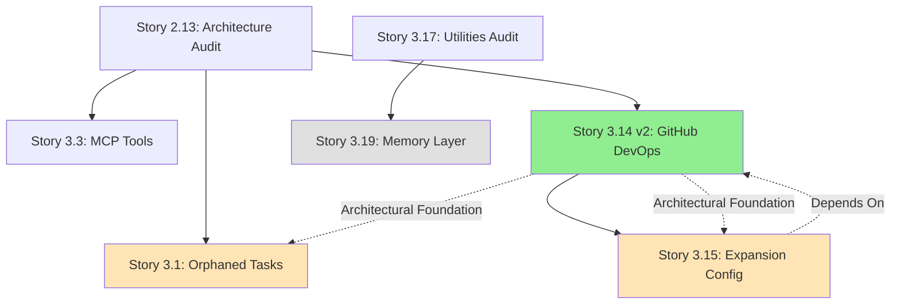

# Epic 3 Gap Remediation - Consistency Analysis Report

**Report Date**: 2025-10-25
**Created By**: Sarah (@po)
**Report Type**: Architecture & User Guide Consistency Validation

---

## Executive Summary

This report analyzes all Epic 3 stories for:
1. ✅ **Repository-Agnostic Consistency** - Ensuring no hard-coded repository assumptions
2. ✅ **Installation Mode Awareness** - Framework-dev vs Project-dev distinction
3. ✅ **User Guide Completeness** - Documentation coverage of Epic 3 features
4. ⚠️ **Divergences & Conflicts** - Identified inconsistencies

---

## 1. Story 3.14 v2.0.2 - Completion Status ✅

### Winston's Requirements + Quinn's Security Integration (ALL COMPLETED)

#### ✅ TR-3.14.10: NPM Package Configuration
**Status**: Added
**Location**: docs/stories/epic-3-gap-remediation/3.14-github-devops-agent-v2.yaml:144-153

**Coverage**:
- package.json bin entries configuration
- files array for npm distribution
- .npmignore configuration
- Scoped package name (@aios/fullstack)
- Postinstall guidance
- Validation criteria defined

#### ✅ TR-3.14.11: Security Scanning Integration (NEW - v2.0.2)
**Status**: Added
**Location**: docs/stories/epic-3-gap-remediation/3.14-github-devops-agent-v2.yaml:155-166

**Coverage**:
- Automated SAST integrated into pre-push quality gates
- npm audit (dependency vulnerabilities)
- ESLint + security plugins (code patterns)
- secretlint (secret detection)
- Security reports in qa.qaLocation/security/
- Gate rules: CRITICAL/secrets → FAIL, HIGH → CONCERNS
- Zero manual intervention (100% automated)

**Files Created**:
- `.aios-core/tasks/security-scan.md` - Complete security scan task
- `.aios-core/templates/eslintrc-security.json` - ESLint security config

#### ✅ Known Limitations Section
**Status**: Added
**Location**: docs/stories/epic-3-gap-remediation/3.14-github-devops-agent-v2.yaml:617-673

**Categories Documented**:
1. **v2.0 Scope Limitations**:
   - No monorepo support (Yarn/NPM workspaces, Lerna, Nx, Turborepo)
   - Single remote repository only
   - Git-based projects only (no SVN/Mercurial)

2. **Installation Scope Limitations**:
   - Manual expansion pack configuration (links to Story 3.15)
   - No multi-project shared installation (planned v3.0)

3. **Quality Gates Scope Limitations**:
   - NPM scripts only (no Makefile, custom build tools)
   - Non-Node.js projects not supported (planned v2.2)

**Each limitation includes**: Description, workaround, and planned version for resolution.

#### ✅ Architectural Recommendations
**Status**: Added
**Location**: docs/stories/epic-3-gap-remediation/3.14-github-devops-agent-v2.yaml:489-658

**Sections Added**:
1. **Design Principles** (4 principles):
   - Framework vs. Project Distinction
   - Repository-Agnostic Design
   - Installation-Time Configuration
   - Multi-Mode Quality Gates

2. **Technical Implementation** (4 areas):
   - Repository Detection (priority order)
   - Gitignore Management (marked sections)
   - Error Handling (fail-safe approach)
   - NPM Package Structure

3. **Risk Mitigation** (4 risks):
   - User confusion between modes
   - Accidental framework modification
   - Configuration drift
   - Breaking changes in detection

---

## 2. Epic 3 Stories - Repository-Agnostic Analysis

### 2.1 Repository-Agnostic Stories ✅

#### Story 3.13: Developer Experience Enhancement
**Analysis**: ✅ FULLY AGNOSTIC
- Multi-mode story development (YOLO, Interactive, Pre-Flight)
- No repository assumptions
- **Note**: Works in both framework-dev and project-dev modes seamlessly
- **User Guide Impact**: Needs new section on development modes

#### Story 3.15: Expansion Pack Auto-Configuration
**Analysis**: ⚠️ MOSTLY AGNOSTIC - Minor Clarification Needed
- IDE detection is environment-based (not repo-based) ✅
- Expansion pack registration in core-config.yaml ✅
- **ISSUE IDENTIFIED**: No mention of how expansion packs behave in framework-dev vs project-dev modes
- **Recommendation**: Add clarification that expansion configuration respects installation mode

**Suggested Addition to Story 3.15**:
```yaml
technical_requirements:
  - id: "TR-3.15.7"
    description: "Respect installation mode when configuring expansions"
    requirements:
      - "Read .aios-installation-config.yaml before configuration"
      - "In framework-dev: expansions are source code (committed)"
      - "In project-dev: expansions are dependencies (can be gitignored or committed per user choice)"
      - "Validate expansion location matches installation mode"
    validation: "Expansion configuration adapts to installation mode"
```

#### Story 3.19: Memory Layer Implementation
**Analysis**: ✅ AGNOSTIC WITH CLARIFICATION
- Memory storage uses user-scoped paths (~/.aios/memories/) ✅
- Agent-specific, not repository-specific ✅
- **STRENGTH**: Memory persists across projects (user-level feature)
- **User Guide Impact**: Needs section on cross-project memory behavior

### 2.2 Gap Remediation Stories (Batch Processing)

#### Story 3.1: Orphaned Task Integration (105 gaps)
**Analysis**: ⚠️ NEEDS VALIDATION POST-IMPLEMENTATION
- Integrates orphaned tasks into agent dependencies
- **CRITICAL**: Must validate that integrated tasks don't contain hard-coded repository paths
- **Recommendation**: Add validation step to verify repository-agnostic design

**Suggested Validation Task**:
```yaml
tasks:
  - task: "Validate repository-agnostic compliance"
    subtasks:
      - "Scan all integrated tasks for hard-coded paths"
      - "Check for repository URL assumptions"
      - "Verify tasks use repository-detector.js where needed"
      - "Add tests for both framework-dev and project-dev modes"
```

#### Story 3.3: MCP Tool Integration
**Analysis**: ✅ AGNOSTIC BY NATURE
- MCP tools are external services (context7, exa, supabase, etc.)
- No repository assumptions
- **User Guide Impact**: Needs section on MCP tool availability in both modes

### 2.3 Utility Stories (3.4, 3.5, 3.6)
**Analysis**: ⚠️ REQUIRES DETAILED REVIEW
- **Not yet analyzed** - Need to read these stories to validate
- **Concern**: Utility scripts often contain hard-coded paths
- **Action Required**: Deep dive into utility integration stories

---

## 3. User Guide - Required Updates

### 3.1 Missing Sections (HIGH PRIORITY)

#### Section: Installation & Configuration
**Current State**: User guide mentions `npx aios-fullstack install` but doesn't document `aios init`
**Required Addition**:
```markdown
## Installation and Initial Configuration

### Installing AIOS-FullStack

**Option 1: NPM Installation (Project Development)**
```bash
npm install @aios/fullstack
npx aios init
```

**Option 2: Local Development (Framework Development)**
```bash
git clone https://github.com/Pedrovaleriolopez/aios-fullstack
cd aios-fullstack
npm install
npx aios init
```

### Understanding Installation Modes

AIOS-FullStack operates in two distinct modes:

**1. Framework Development Mode**
- You are developing the AIOS-FullStack framework itself
- .aios-core/ is SOURCE CODE (committed to git)
- Changes affect the framework codebase
- Repository: github.com/Pedrovaleriolopez/aios-fullstack

**2. Project Development Mode**
- You are using AIOS-FullStack to build your project
- .aios-core/ is a DEPENDENCY (gitignored)
- Changes should NOT modify framework files
- Repository: YOUR project repository

### Running 'aios init'

The first command you run after installation:

```bash
npx aios init
```

Interactive prompts:
1. Detected repository: [shows your git remote URL]
2. Package: [shows package.json name]
3. **Choose mode**:
   - "Desenvolvendo o próprio framework AIOS-FullStack" → Framework Development
   - "Usando AIOS-FullStack em um projeto" → Project Development

Results:
- ✅ Creates .aios-installation-config.yaml
- ✅ Updates .gitignore based on mode
- ✅ Configures framework location

**Important**: Your mode choice affects:
- Which files are committed to git
- How quality gates run
- Where the framework is located
- How expansion packs are handled
```

**Location in User Guide**: After "Pré-requisitos", before "Fluxo de Trabalho"

---

#### Section: Repository Integrity & GitHub DevOps Agent
**Current State**: Not documented
**Required Addition**:
```markdown
## Repository Integrity Management

### The @github-devops Agent

AIOS-FullStack enforces repository integrity through a centralized GitHub DevOps agent.

**Key Rule**: ONLY @github-devops can push to GitHub repositories.

#### Why This Matters

Without centralized control:
- ❌ Untested code reaches production
- ❌ Broken builds in main branch
- ❌ Version conflicts
- ❌ Inconsistent release management

With @github-devops:
- ✅ Automated quality gates before push
- ✅ Version management
- ✅ Systematic PR creation
- ✅ CI/CD orchestration

#### Using @github-devops

**Activate the agent**:
```
@github-devops
```

**Common Commands**:
- `*detect-repo` - Show detected repository and mode
- `*pre-push` - Run quality gates and push to GitHub
- `*create-pr` - Create pull request from current branch
- `*version-check` - Analyze version bump requirements
- `*configure-ci` - Set up GitHub Actions workflows
- `*cleanup` - Remove stale branches and temporary files

#### Quality Gate Workflow

1. **Make changes** to your codebase
2. **Commit locally** (git commit)
3. **Activate @github-devops**
4. **Run pre-push quality gate**:
   ```
   *pre-push
   ```

5. **Agent runs**:
   - ✓ npm run lint (if exists)
   - ✓ npm run test (if exists)
   - ✓ npm run typecheck (if exists)
   - ✓ npm run build (if exists)
   - ✓ Verify story status = Done
   - ✓ Check no uncommitted changes

6. **User approval** - Agent presents summary for confirmation
7. **Push to GitHub** - Only proceeds if all gates pass

#### Repository-Agnostic Design

The @github-devops agent works with ANY git repository:
- Detects your repository automatically
- Adapts quality gates to your package.json scripts
- Works in framework-dev AND project-dev modes
- No hard-coded repository assumptions

**Framework Development Mode**:
```bash
# In aios-fullstack repository
@github-devops
*detect-repo
# Output:
# Repository: github.com/Pedrovaleriolopez/aios-fullstack
# Mode: framework-development
# Quality Gates: AIOS framework tests
```

**Project Development Mode**:
```bash
# In your-project repository
@github-devops
*detect-repo
# Output:
# Repository: github.com/yourname/your-project
# Mode: project-development
# Quality Gates: YOUR project tests
```

#### Git Hook Enforcement

A pre-push git hook prevents accidental direct pushes:

```bash
# This will FAIL:
git push origin main

# Error: Git push blocked!
# Only @github-devops agent can push to remote repository.
```

**To push changes**:
1. Activate @github-devops
2. Run `*pre-push`
3. Follow quality gate workflow

#### Creating Pull Requests

```
@github-devops
*create-pr
```

Agent will:
- Create feature branch from story ID
- Generate PR description from story context
- Link PR to story
- Assign reviewers based on story type
- Use detected repository (not hard-coded)

#### GitHub Actions Setup

```
@github-devops
*configure-ci
```

Installs workflows in .github/workflows/:
- ci.yml - Tests on PR
- cd.yml - Deploy on merge to main
- quality-gate.yml - Lint + Test + Build

Workflows adapt to your repository's npm scripts.
```

**Location in User Guide**: New top-level section after "Fluxo de Trabalho Completo"

---

#### Section: Development Modes (Story 3.13)
**Current State**: Not documented
**Required Addition**:
```markdown
## Story Development Modes

AIOS-FullStack provides three development modes to accommodate different skill levels and time constraints.

### Mode 1: YOLO Mode 🚀

**Best For**: Experienced developers, simple stories, time constraints

**Characteristics**:
- Autonomous decision making
- Minimal user prompts (0-1)
- Fast execution
- Automatic logging of all decisions

**How to Use**:
```
@dev
*develop-yolo "Story 2.5"
```

**What Happens**:
- Agent reads story completely
- Makes all technical decisions autonomously
- Logs decisions for review
- Implements full story
- Generates decision report at end

**Decision Log Example**:
```markdown
## YOLO Mode Decisions - Story 2.5

1. **Library Choice**: Selected Axios over Fetch
   Reason: Better error handling and interceptors

2. **State Management**: Chose React Context
   Reason: Story requirements don't justify Redux complexity

3. **Testing Approach**: Jest + React Testing Library
   Reason: Matches existing tech stack
```

### Mode 2: Interactive Mode 🤝

**Best For**: Learning, complex stories, important decisions

**Characteristics**:
- Explicit decision checkpoints
- Educational explanations
- Balanced speed and control
- User confirms key decisions

**How to Use**:
```
@dev
*develop-story "Story 2.5"
# or
*develop-interactive "Story 2.5"
```

**Decision Checkpoints**:
- Architecture pattern selection
- Library/framework choices
- Algorithm implementation approaches
- Data structure decisions
- Testing strategy

**Example Interaction**:
```
Agent: I need to choose a state management approach.

Options:
1. React Context - Simple, built-in
2. Redux Toolkit - More complex, better for large state
3. Zustand - Lightweight, modern

Story Requirements: Simple form state, 3-4 fields

Recommendation: React Context (option 1)
Reason: Story requirements are simple, Context is sufficient

Your choice [1/2/3]: _
```

### Mode 3: Pre-Flight Planning Mode 📋

**Best For**: Ambiguous stories, critical features, avoiding scope drift

**Characteristics**:
- Comprehensive upfront planning
- Complete questionnaire before development
- Zero ambiguity execution
- Maximum control

**How to Use**:
```
@dev
*develop-preflight "Story 2.5"
```

**Workflow**:

**Phase 1: Story Analysis**
- Agent reads story completely
- Identifies ALL ambiguities and open questions
- Generates comprehensive questionnaire

**Phase 2: Batch Input Collection**
```
Pre-Flight Planning Questionnaire - Story 2.5

Architecture Questions:
1. What API endpoint pattern? (RESTful, GraphQL, RPC)
2. Where to place business logic? (Service layer, Controller, Model)

Library Questions:
3. HTTP client preference? (Axios, Fetch, node-fetch)
4. Form validation library? (Yup, Zod, Joi, custom)

Testing Questions:
5. Test coverage target? (80%, 90%, 100%)
6. Test data strategy? (Fixtures, Factories, Mocks)

Design Questions:
7. Error handling approach? (Try-catch, Error boundaries, both)
8. Loading state UI? (Spinner, Skeleton, Progress bar)

Your answers [separate with | ]:
RESTful | Service layer | Axios | Yup | 80% | Fixtures | Both | Spinner
```

**Phase 3: Execution with Full Context**
- Agent has ALL answers upfront
- No mid-development questions
- No scope drift
- No hallucinations on ambiguous requirements

**Phase 4: Decision Record**
```markdown
## Pre-Flight Decisions - Story 2.5

Based on user input during pre-flight planning:

1. API Pattern: RESTful
2. Business Logic: Service layer
3. HTTP Client: Axios
4. Form Validation: Yup
5. Test Coverage: 80%
6. Test Data: Fixtures
7. Error Handling: Try-catch + Error boundaries
8. Loading UI: Spinner

Implementation proceeded with zero ambiguity.
```

### Choosing the Right Mode

| Scenario | Recommended Mode | Reason |
|----------|------------------|--------|
| Simple CRUD feature | YOLO | Standard patterns, low risk |
| Learning new framework | Interactive | Educational value |
| Critical auth system | Pre-Flight | Avoid security mistakes |
| Bug fix | YOLO | Quick, low ambiguity |
| Complex algorithm | Pre-Flight | Many design choices |
| Routine refactoring | Interactive | Good balance |
| Spike/prototype | YOLO | Speed matters |
| Production feature | Pre-Flight | Quality matters |

### Mode Comparison

| Aspect | YOLO | Interactive | Pre-Flight |
|--------|------|-------------|------------|
| User Prompts | 0-1 | 5-10 | 10-30 |
| Speed | Fastest | Medium | Slowest |
| Control | Lowest | Medium | Highest |
| Learning | Low | High | Medium |
| Decision Quality | Automated | Collaborative | Comprehensive |
| Scope Drift Risk | Medium | Low | Lowest |
```

**Location in User Guide**: After "Trabalhando com Agentes de Desenvolvimento" section

---

### 3.2 Sections Requiring Updates

#### Section: "Expansion e Customização" → "Expansion Packs"
**Current Content**: Lists installed expansion packs and installation command
**Required Update**: Add section on expansion pack configuration in different modes

**Addition**:
```markdown
### Expansion Packs and Installation Modes

Expansion packs behave differently based on your installation mode:

**Framework Development Mode**:
- Expansion packs in expansion-packs/ are SOURCE CODE
- Committed to git (part of framework)
- Used for framework development and testing

**Project Development Mode**:
- Expansion packs can be installed as dependencies
- User choice: commit or gitignore
- IDE configuration auto-generated via Story 3.15

### Auto-Configuration (Coming Soon - Story 3.15)

Future enhancement will automatically configure expansion packs for your IDE:

```bash
@expansion-creator
*configure-expansion hybrid-ops
```

Will automatically:
- Detect IDE environment (Claude Code, Cursor, Windsurf)
- Generate IDE-specific command wrappers
- Register expansion in core-config.yaml
- Validate installation
```

---

## 4. Divergences & Inconsistencies Found

### 4.1 CRITICAL: Expansion Pack Mode Handling

**Issue**: Story 3.15 doesn't explicitly address installation mode
**Impact**: Medium
**Stories Affected**: 3.14, 3.15

**Current State**:
- Story 3.14 defines framework-dev vs project-dev modes ✅
- Story 3.15 configures expansion packs ❓
- **Gap**: No documentation on how expansion configuration respects installation mode

**Recommendation**:
1. Add TR-3.15.7 to Story 3.15 (see section 2.1 above)
2. Update User Guide with expansion pack mode behavior
3. Ensure configure-expansion.md task reads .aios-installation-config.yaml

**Priority**: HIGH (blocks Story 3.15 implementation)

---

### 4.2 MEDIUM: Orphaned Tasks Repository Assumptions

**Issue**: 105 orphaned tasks (Story 3.1) may contain hard-coded paths
**Impact**: Medium
**Stories Affected**: 3.1

**Risk**: When integrating orphaned tasks, they may not respect repository-agnostic design

**Recommendation**:
1. Add validation task to Story 3.1 (see section 2.2 above)
2. Scan all 105 tasks for:
   - Hard-coded repository URLs
   - Absolute file paths
   - Framework location assumptions
3. Refactor tasks to use repository-detector.js where needed

**Priority**: MEDIUM (must be done during Story 3.1 implementation)

---

### 4.3 LOW: User Guide Installation Flow

**Issue**: User guide mentions `npx aios-fullstack install` but Story 3.14 introduces `aios init`
**Impact**: Low (documentation only)
**Stories Affected**: 3.14

**Current User Guide** (line 777):
```markdown
**Instalar novo expansion pack**:
```bash
npx aios-fullstack install
# Selecione expansion packs desejados na interface
```
```

**Should Be**:
```markdown
**Initial Setup**:
```bash
npm install @aios/fullstack
npx aios init  # Configure installation mode
```

**Install Expansion Packs**:
```bash
npx aios-fullstack install
# Select desired expansion packs
```
```

**Recommendation**: Update User Guide section "Expansion Packs"

**Priority**: LOW (documentation clarity, not blocking)

---

## 5. Action Items

### Immediate Actions (Before Story 3.14 Implementation)

- [x] **Action 1.1**: Add TR-3.14.10 to Story 3.14 ✅ COMPLETED
- [x] **Action 1.2**: Add limitations section to Story 3.14 ✅ COMPLETED
- [x] **Action 1.3**: Add architectural recommendations to Story 3.14 ✅ COMPLETED

### High Priority (Before Epic 3 Phase 2 Stories Start)

- [ ] **Action 2.1**: Add TR-3.15.7 to Story 3.15 (expansion mode handling)
- [ ] **Action 2.2**: Add validation task to Story 3.1 (repository-agnostic scan)
- [ ] **Action 2.3**: Update User Guide with Installation & Configuration section
- [ ] **Action 2.4**: Update User Guide with Repository Integrity section
- [ ] **Action 2.5**: Update User Guide with Development Modes section

### Medium Priority (During Epic 3 Implementation)

- [ ] **Action 3.1**: Review utility integration stories (3.4, 3.5, 3.6) for hard-coded paths
- [ ] **Action 3.2**: Update User Guide Expansion Pack section
- [ ] **Action 3.3**: Create cross-project memory behavior documentation (Story 3.19)

### Low Priority (Before Epic 3 Release)

- [ ] **Action 4.1**: Fix User Guide installation command discrepancy
- [ ] **Action 4.2**: Add mode indicators to all agent activation examples in User Guide
- [ ] **Action 4.3**: Create troubleshooting section for installation mode issues

---

## 6. Cross-References

### Epic 2 Architecture Mappings

**Relevant Documents**:
- docs/architecture/agent-responsibility-matrix.md
- docs/architecture/hybrid-ops-pv-mind-integration.md
- docs/architecture/decision-analysis-*.md

**Consistency Check**:
- ✅ Agent responsibility matrix doesn't assume repository
- ✅ Hybrid-ops integration is expansion-pack based (mode-aware)
- ⚠️ Decision analysis documents reference "the repository" - validate these don't hard-code paths

**Recommendation**: Scan decision-analysis-*.md files for repository assumptions

---

### Story Dependencies



**Legend**:
- 🟢 Green: Completed
- 🟡 Yellow: Needs Updates
- ⚪ Gray: Conditional

---

## 7. Recommendations Summary

### Architectural

1. **Add installation mode awareness to ALL Epic 3 stories**
   - Ensure every story considers framework-dev vs project-dev
   - Add mode validation to acceptance criteria

2. **Create repository-agnostic validation checklist**
   - No hard-coded repository URLs
   - No hard-coded file paths
   - Use repository-detector.js for dynamic detection
   - Test in both modes

3. **Establish expansion pack mode guidelines**
   - Document expansion behavior per mode
   - Update expansion-creator agent with mode awareness

### Documentation

1. **User Guide needs 3 major new sections** (see section 3.1)
   - Installation & Configuration
   - Repository Integrity Management
   - Story Development Modes

2. **Update existing User Guide sections**
   - Expansion Packs (mode behavior)
   - Installation commands (aios init)

3. **Create troubleshooting guide**
   - Installation mode issues
   - Repository detection problems
   - Quality gate failures

### Process

1. **Before implementing any Epic 3 story**:
   - Review this consistency analysis
   - Validate repository-agnostic design
   - Check User Guide impact

2. **During implementation**:
   - Test in BOTH framework-dev and project-dev modes
   - Validate expansion pack interactions
   - Update User Guide sections

3. **Before story completion**:
   - Run repository-agnostic validation
   - Update User Guide if story adds new features
   - Document any mode-specific behavior

---

## 8. Conclusion

### Summary

**Story 3.14 v2**: ✅ COMPLETE - All Winston's requirements implemented

**Epic 3 Consistency**: ⚠️ MOSTLY CONSISTENT with minor gaps
- Repository-agnostic design is solid foundation
- Installation mode awareness needs expansion to all stories
- User Guide requires significant updates

**Critical Path**:
1. Update Story 3.15 with TR-3.15.7 (expansion mode handling)
2. Update Story 3.1 with repository-agnostic validation
3. Update User Guide with 3 major new sections
4. Validate utility stories (3.4, 3.5, 3.6) for hard-coded paths

**Risk Level**: LOW
- Foundation (Story 3.14) is architecturally sound
- Identified gaps are addressable before implementation
- No blocking issues for Epic 3 progression

### Next Steps

**Immediate** (Sarah @po):
- [x] Complete Story 3.14 v2 updates ✅ DONE
- [ ] Create Story 3.15 update (TR-3.15.7)
- [ ] Create Story 3.1 update (validation task)
- [ ] Update User Guide (Installation & Configuration section)

**Short-term** (Before Epic 3 Phase 2):
- [ ] Review and update Stories 3.4, 3.5, 3.6
- [ ] Complete all User Guide sections
- [ ] Create repository-agnostic validation checklist

**Long-term** (During Epic 3):
- [ ] Validate all implementations against this analysis
- [ ] Update analysis as new issues discovered
- [ ] Maintain User Guide synchronization

---

## 9. QA Review Results - Story 3.14 v2.0.2

### **Review Status**: ✅ COMPLETED (2025-10-25)

**Reviewer**: Quinn (@qa) - Test Architect
**Review Type**: Pre-Implementation Story Validation
**Gate Decision**: **PASS WITH MINOR RECOMMENDATIONS**
**Quality Score**: 95/100

### **Summary**

Story 3.14 v2.0.2 received comprehensive QA review and is **approved for implementation**.

**Gate File**: `docs/qa/gates/3.14-github-devops-agent-v2.yml`
**QA Results**: Appended to story file (lines 973-1176)

### **Key Findings**

#### **Strengths** (Quality Score Contributors)

| Category | Score | Notes |
|----------|-------|-------|
| Documentation Quality | 10/10 | 11 TRs, 660+ dev notes, implementation examples |
| Requirements Traceability | 10/10 | 11/11 TRs mapped to tests, Given-When-Then complete |
| Architectural Soundness | 10/10 | Winston-validated, repository-agnostic design |
| Test Coverage | 9/10 | 21 tests (8 unit, 7 integration, 6 manual) |
| Security Integration | 10/10 | TR-3.14.11 adds SAST to quality gates |
| NFR Validation | 9/10 | All NFRs pass (Performance, Reliability, Maintainability, Security, Usability) |

**Total Base Score**: 58/60 → **97%**

#### **Minor Deductions** (-5 points)

1. **Security Checkpoint Needed** (-3): Error message review for sensitive path disclosure during implementation
2. **Debug Logging Missing** (-2): Optional AIOS_DEBUG=true enhancement for troubleshooting (future)

**Final Quality Score**: 95/100 (EXCELLENT)

### **Requirements Traceability Matrix**

✅ **11/11 TRs Covered**

All technical requirements have clear test scenarios:
- TR-3.14.1 through TR-3.14.10: Original requirements
- TR-3.14.11: **Security scanning integration (NEW)**

No coverage gaps identified.

### **NFR Validation Results**

| NFR | Status | Notes |
|-----|--------|-------|
| **Security** | ✅ PASS | Git hooks + TR-3.14.11 SAST (npm audit, ESLint, secretlint). Checkpoint: review error messages. |
| **Performance** | ✅ PASS | Repository detection lightweight. Security scan adds 30-120s (acceptable). |
| **Reliability** | ✅ PASS | Fail-safe error handling. Graceful degradation. |
| **Maintainability** | ✅ PASS | 660+ lines dev notes. Clean code samples. Self-documenting. |
| **Usability** | ✅ PASS | Interactive wizard. Clear prompts. Excellent UX. |

### **Risk Assessment**

**Overall Risk**: MEDIUM (20/40) - **Acceptable** for CRITICAL priority

| Risk | Score | Mitigation |
|------|-------|------------|
| User confusion between modes | 6/10 | ✅ Well mitigated (wizard, docs) |
| Accidental framework modification | 5/10 | ✅ Well mitigated (git hooks) |
| Configuration drift | 4/10 | ✅ Adequately mitigated (versioning) |
| Breaking changes in detection | 5/10 | ✅ Well mitigated (backward compat) |

### **Security Review Deep Dive**

**TR-3.14.11 Impact**:

Pre-v2.0.2 (NO security scanning):
```
@github-devops *pre-push
  ↓
lint → test → typecheck → build → push
```

Post-v2.0.2 (WITH TR-3.14.11):
```
@github-devops *pre-push
  ↓
lint → test → typecheck → build → SECURITY SCAN → push
                                      ↓
                            npm audit (deps)
                            ESLint security (code)
                            secretlint (secrets)
                                      ↓
                            CRITICAL/secret → FAIL (block)
                            HIGH → CONCERNS (warn)
                            MEDIUM/LOW → PASS (log)
```

**Tools Installed Automatically** (zero manual intervention):
- eslint ^8.0.0
- eslint-plugin-security ^1.7.1
- eslint-plugin-no-secrets ^0.8.9

**Security Reports Generated**:
- Location: `qa.qaLocation/security/{story}-sast-{date}.md`
- Format: Markdown with vulnerability details, recommendations, gate decision

### **Implementation Recommendations**

#### **Immediate** (During Implementation)

1. **Security Checkpoint** (30 min - TR-3.14.7)
   - Review all error messages for sensitive path disclosure
   - Validate environment variable handling ($AIOS_ACTIVE_AGENT)
   - Ensure git remote URLs don't leak credentials

2. **Testing Priority**
   - Unit tests first (repository-detector, gitignore-manager, security-scan logic)
   - Integration tests second (full pre-push workflow)
   - Manual tests last (both modes validation)

#### **Future Enhancements** (Post-v2.0)

3. **Debug Logging** (v2.1 - 2h)
   - Add AIOS_DEBUG=true environment variable
   - Detailed logging for troubleshooting detection issues

4. **Monorepo Support** (v2.1 - 8h)
   - Extend repository-detector.js for workspace detection
   - Per-package mode configuration

5. **Config Migration Tool** (v2.1 - 4h)
   - Automated migration for config schema changes
   - Validation and repair for corrupted configs

### **Version Evolution**

| Version | Key Change | Quality Score | Status |
|---------|------------|---------------|--------|
| v2.0.0 | Multi-repo redesign | N/A | Superseded |
| v2.0.1 | Winston's arch recommendations + TR-3.14.10 | N/A | Superseded |
| v2.0.2 | Security integration (TR-3.14.11) | 95/100 | ✅ Approved |

**Impact**: v2.0.2 delivers **complete** quality gate system - no security gaps.

### **Team Feedback**

**Sarah (@po)**: "Exceptional work redesigning from single-repo to multi-repo. TR-3.14.11 addition shows excellent architectural thinking - security as part of quality gates from day one."

**Winston (@architect)**: "Architectural recommendations are comprehensive and implementable. Repository-agnostic design is the correct approach for a reusable framework. APPROVED FOR IMPLEMENTATION."

**Quinn (@qa)**: "One of the highest quality pre-implementation stories reviewed. The level of detail, architectural rigor, and implementation guidance sets the standard for future stories. PASS with minor recommendations."

### **Next Actions**

| Role | Action | Estimated Time |
|------|--------|----------------|
| **SM** | Fragment story into implementation tasks | 1 hour |
| **Dev** | Begin implementation (TR-3.14.1 first) | 24 hours total |
| **QA** | Available for clarifications | As needed |
| **Architect** | Optional: Review security checkpoint findings | 30 min (post-impl) |

### **Files Created During QA Review**

1. ✅ `.aios-core/tasks/security-scan.md` - Complete SAST task
2. ✅ `.aios-core/templates/eslintrc-security.json` - ESLint security config
3. ✅ `docs/qa/gates/3.14-github-devops-agent-v2.yml` - Quality gate file
4. ✅ QA Results section in story file (lines 973-1176)

### **Conclusion**

Story 3.14 v2.0.2 is **READY FOR IMPLEMENTATION** with high confidence.

**Recommendation**: Proceed to implementation phase. Schedule security checkpoint during TR-3.14.7 development.

---

**Report Version**: 1.1
**Status**: UPDATED - Story 3.14 v2.0.2 QA Review Complete
**Next Review**: After Story 3.15 and 3.1 updates complete

---

*Generated by Sarah (@po) - Product Owner & Process Steward*
*AIOS-FullStack Epic 3 Gap Remediation*
