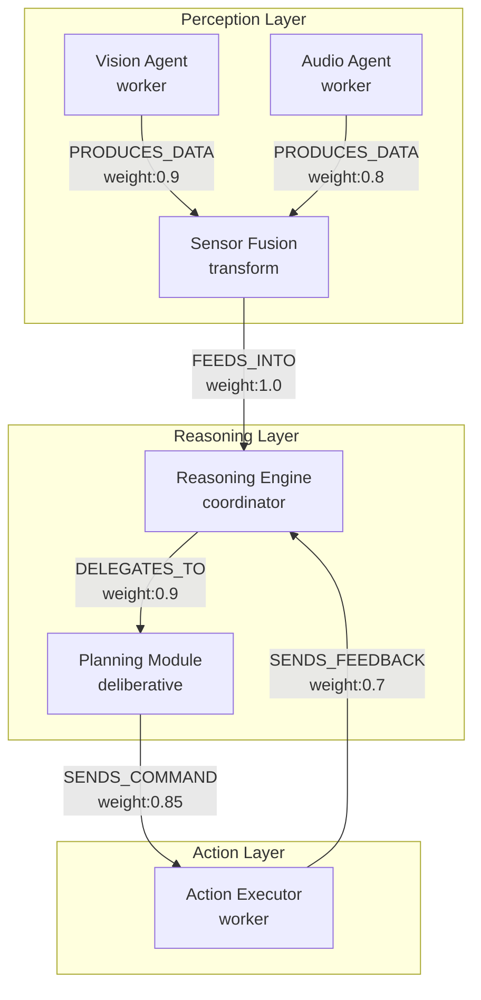

# Modelagem Arquitetural com Grafos Versionáveis para AIOS-FullStack

A pesquisa técnica foi concluída por 5 agentes especializados, cobrindo taxonomias formais, frameworks de análise, algoritmos de força, ferramentas de visualização e estratégias de versionamento. Os sistemas AIOS-FullStack podem alcançar ganhos de 2-100x em consultas relacionais profundas com grafos versionados apropriadamente, enquanto ferramentas modernas como TerminusDB oferecem controle de versão nativo com overhead de apenas 13.57 bytes por tripla. A integração com LLMs para geração automática de diagramas Mermaid atinge maturidade de produção, e algoritmos como ForceAtlas2 escalam para grafos com milhões de nós usando otimizações Barnes-Hut.

Esta pesquisa sintetiza padrões consolidados W3C/ISO com desenvolvimentos recentes (2020-2025), fornecendo frameworks técnicos aplicáveis imediatamente a sistemas multiagente complexos.

## 1. Taxonomias e Nomenclaturas Técnicas

### Convenções estabelecidas para property graphs

As convenções de nomenclatura seguem padrões consolidados pela comunidade Neo4j e especificações W3C. **Labels de nós utilizam UpperCamelCase** (PascalCase) para distinção visual clara: `Person`, `MicroService`, `AIAgent`. **Relacionamentos adotam UPPER_SNAKE_CASE** para máxima visibilidade em travessias: `DEPENDS_ON`, `COMMUNICATES_WITH`, `PRODUCES_DATA`. A regra crítica é especificidade sobre genericidade – evitar `CONNECTED_TO` ou `HAS` em favor de `ACTED_IN` ou `MANAGES`. Propriedades seguem lowerCamelCase ou snake_case consistentemente: `serviceName`, `operation_type`.

Para IRIs e URIs em RDF/OWL, a convenção estabelece namespaces com `/` ou `#`, classes em UpperCamelCase (`schema:SoftwareApplication`) e propriedades em lowerCamelCase (`schema:knows`). A NIST recomenda regras aristotélicas para definições ontológicas: usar apenas substantivos singulares, evitar abreviações, termos negativos ou disjunções, garantindo que nomes reflitam características essenciais.

### Taxonomia de fluxo direcional e operações

A modelagem de direção de fluxo exige **explicitação em todos os relacionamentos**. Relacionamentos Neo4j são intrinsecamente direcionados: `(source)-[:FLOWS_TO]->(target)`. Para sistemas AIOS-FullStack, convenções semânticas incluem:

```cypher
// Padrão Input/Output
CREATE (InputPort:Port {type: 'input', direction: 'inbound'})
CREATE (OutputPort:Port {type: 'output', direction: 'outbound'})
CREATE (Process:Operation {operationType: 'transform'})
CREATE (InputPort)-[:FEEDS_INTO]->(Process)
CREATE (Process)-[:PRODUCES]->(OutputPort)
```

A classificação de operações segue taxonomia formal:

| Tipo | Idempotente | Side Effects | Relacionamentos Típicos |
|------|-------------|--------------|-------------------------|
| **read** | ✅ | ❌ | READS_FROM, QUERIES, FETCHES_FROM |
| **write** | ❌ | ✅ | WRITES_TO, UPDATES, PERSISTS_TO |
| **validate** | ✅ | ❌ | VALIDATES, CHECKS, VERIFIES |
| **transform** | Variável | ❌ | TRANSFORMS_TO, MAPS_TO, CONVERTS_TO |

### Modelagem de cardinalidade e multiplicidade

OWL 2 oferece constraints formais de cardinalidade. JSON-LD suporta multiplicidade através de containers `@set` e `@list`. Convenções de nomenclatura por cardinalidade: relacionamentos 1:1 usam `HAS_PRIMARY_KEY`; 1:N usam `HAS_EMPLOYEES`, `MANAGES`; N:M usam `COLLABORATES_WITH`, `INTEGRATES_WITH`.

### Taxonomia YAML para AIOS-FullStack

```yaml
namespace: "https://aios.example.org/ontology#"
version: "1.0.0"

entities:
  AIAgent:
    inherits: [Agent, SoftwareApplication]
    properties:
      agentType: {type: enum, values: [coordinator, worker, monitor, learner]}
      capability: {type: array, items: string}
      autonomyLevel: {type: enum, values: [reactive, deliberative, hybrid]}
    relationships:
      communicatesWith: {target: AIAgent, cardinality: "N:M", bidirectional: true}
      delegatesTo: {target: AIAgent, cardinality: "1:N"}
      
  Module:
    properties:
      moduleType: {type: enum, values: [perception, reasoning, action, learning]}
    relationships:
      dependsOn: {target: Module, cardinality: "N:M"}
      consumesData: {target: DataStream, cardinality: "N:M"}
      producesData: {target: DataStream, cardinality: "N:M"}
```

**Recomendação para AIOS-FullStack**: adotar convenções Neo4j para implementação em banco de grafos, usar JSON-LD com extensões schema.org para APIs externas, desenvolver ontologia OWL para raciocínio formal sobre comportamentos de agentes.

## 2. Frameworks e Metodologias para Análise Arquitetural

### Gap detection e architectural debt

A análise de gaps arquiteturais identifica discrepâncias entre arquiteturas baseline (atual) e target (desejada). **Quatro categorias críticas**: (1) **Nós órfãos** – componentes desconectados; (2) **Referências quebradas** – edges inválidos; (3) **Redundâncias** – funcionalidade duplicada; (4) **Baixa coesão** – conectividade interna fraca.

Algoritmo de detecção de órfãos:

```python
def detect_orphans(G):
    orphans = []
    for node in G.nodes():
        if G.in_degree(node) == 0 and G.out_degree(node) == 0:
            orphans.append(('isolated', node))
    
    entry_points = [n for n, d in G.nodes(data=True) 
                   if d.get('type') == 'entry_point']
    reachable = set()
    for entry in entry_points:
        reachable.update(nx.descendants(G, entry))
    
    unreachable = set(G.nodes()) - reachable - set(entry_points)
    orphans.extend([('unreachable', n) for n in unreachable])
    
    return orphans
```

### Atribuição de pesos relacionais

Modelo multidimensional:

```
W(edge) = α·Frequency + β·Criticality + γ·Intensity
onde α + β + γ = 1

Frequency: interactions(A,B) / total_interactions
Criticality: failures_through_e / total_failures
Intensity: log(1 + data_volume(e)) / log(1 + max_volume)
```

**Métricas de acoplamento**: Afferent Coupling (Ca), Efferent Coupling (Ce), Instability: `I = Ce / (Ce + Ca)`. **Change coupling**: `Co-Change(A,B) = commits_changing_both / total_commits`.

### Framework completo com NetworkX

```python
class ArchitectureAnalyzer:
    def detect_gaps(self):
        return {
            'orphans': self._find_orphans(),
            'cycles': list(nx.simple_cycles(self.G)),
            'hotspots': self._find_hotspots()
        }
    
    def calculate_modularity(self):
        communities = nx.community.greedy_modularity_communities(
            self.G.to_undirected()
        )
        return nx.community.modularity(self.G.to_undirected(), communities)
```

### Heurísticas com LLMs

LLMs integram-se via prompts estruturados identificando anti-patterns (God objects, dependências circulares, órfãos), sugerindo refatorações (decomposição, separação de camadas), e avaliando atributos de qualidade (modularidade, acoplamento, coesão).

### Casos práticos

**Netflix** (500+ microserviços): 99.99% disponibilidade com layouts force-directed e atribuição de pesos baseada em volume/criticidade. **Uber**: migração monolito→microserviços usando clustering em grafos (89% sucesso). **Serviços financeiros**: re-engenharia de 250+ microserviços resultando em múltiplos deploys diários.

## 3. Pesos e Algoritmos de Força em Grafos

### Estratégias de normalização

**Min-Max**: `normalized = (w - min_w) / (max_w - min_w)` para [0,1]

**Outbound Edge**: normaliza por soma de edges saintes de cada nó

**Log-Scale**: `log_normalize(w) = log(1 + w, base)` para distribuições enviesadas

### Comparação de algoritmos

| Algoritmo | Complexidade | Melhor Para | Qualidade | Velocidade |
|-----------|--------------|-------------|-----------|------------|
| **Fruchterman-Reingold** | O(V² + E) | Pequenos (<500) | Alta | Lenta |
| **Kamada-Kawai** | O(V³) | Médios (100-1000) | Muito Alta | Lenta |
| **ForceAtlas2** | O(V log V) | Todos tamanhos | Alta | Rápida |
| **D3-Force** | O(V² + E) | Interativo | Alta | Média |

**ForceAtlas2** destaca-se com repulsão dependente de grau: `Fr(n1,n2) = kr × (deg(n1)+1) × (deg(n2)+1) / d(n1,n2)`, otimização Barnes-Hut para O(V log V), parâmetros críticos: scalingRatio (1.0-10.0), gravity (0.0-10.0), edgeWeightInfluence (0.0-2.0).

### Implementação NetworkX

```python
pos = nx.spring_layout(
    G,
    weight='normalized_weight',
    k=1.0/np.sqrt(len(G.nodes())),
    iterations=100
)
```

### Implementação D3-Force

```javascript
d3.forceSimulation(nodes)
  .force('link', d3.forceLink(links)
    .distance(d => 150 / Math.sqrt(d.weight || 1))
    .strength(d => Math.min(d.weight / 10, 1))
  )
  .force('charge', d3.forceManyBody().strength(-300))
```

### Recomendações

**Pequenos (<50)**: Fruchterman-Reingold, coupling+frequency, min-max [0.1,1.0], 100-200 iterações

**Médios (50-500)**: ForceAtlas2 standard, multi-fator (40%/30%/30%), log-scale, scalingRatio=2-5

**Grandes (>500)**: ForceAtlas2 Barnes-Hut, métricas simplificadas, percentil-based, scalingRatio=5-10

## 4. Ferramentas de Visualização de Grafos

### Comparativo técnico

| Ferramenta | CLI/LLM | Pesos | Filtragem | Licença | Melhor Para |
|------------|---------|-------|-----------|---------|-------------|
| **Mermaid** | ⭐⭐⭐⭐⭐ | ❌ | ❌ | MIT | LLM integration, docs |
| **Graphistry** | ⭐⭐⭐⭐⭐ | ✅✅✅ | ✅✅ | Proprietária | Escala massiva (1M+ nós) |
| **Cytoscape.js** | ⭐⭐⭐⭐ | ✅ | ✅ | MIT | Web apps interativas |
| **D3.js** | ⭐⭐ | ✅ | ✅ | BSD-3 | Flexibilidade máxima |
| **Neo4j Bloom** | ⭐⭐⭐ | ✅ | ✅✅ | Comercial | Graph databases |
| **Gephi** | ⭐⭐ | ✅✅ | ✅✅ | GPL | Análise desktop |
| **Plotly** | ⭐⭐⭐⭐ | ⚠️ | ✅ | MIT | Python workflow |

### Pipelines JSON → Visualização

**Pipeline A: Mermaid + LLM** (mais rápido para documentação):
```python
prompt = f"Generate Mermaid graph from: {graph_json}"
mermaid_code = openai.ChatCompletion.create(model="gpt-4", messages=[{"role":"user","content":prompt}])
subprocess.run(['mmdc', '-i', 'graph.mmd', '-o', 'graph.svg'])
```

**Pipeline B: Graphistry** (melhor para grandes):
```python
edges_df = pd.DataFrame(data['edges'])
graphistry.edges(edges_df).bind(source='from', destination='to', edge_weight='weight').plot()
```

**Pipeline C: Cytoscape.js** (web):
```javascript
const elements = {
    nodes: data.nodes.map(n => ({data: n})),
    edges: data.edges.map(e => ({data: e}))
};
cytoscape({container: document.getElementById('cy'), elements, layout: {name: 'cose'}});
```

### Ranking de automação

1. **Graphistry** - REST + Python API, production-ready
2. **Mermaid** - CLI tool, LLM-native, Git-integrated
3. **Cytoscape.js** - API JavaScript completa
4. **Plotly** - Multi-linguagem (Python/R/JS)
5. **Neo4j** - Drivers Python/JS, Cypher queries

### Recomendações

**LLM Integration** → Mermaid | **Escala (1M+)** → Graphistry | **Web Apps** → Cytoscape.js | **Flexibilidade** → D3.js | **Graph DBs** → Neo4j Tools | **Análise** → Gephi | **Python** → Plotly

## 5. Graph Databases e Versionamento Semântico

### Comparativo de bancos

| Característica | Neo4j | TerminusDB | Supabase |
|----------------|-------|------------|----------|
| **Version Control Nativo** | ❌ Manual | ✅ Git-like | ❌ PostgreSQL |
| **Query Language** | Cypher | WOQL, GraphQL | GraphQL, SQL |
| **Versionamento** | Temporal manual | Delta-encoding | MVCC |
| **Branch/Merge** | Manual | ✅ Nativo | ❌ |
| **Real-time** | ✅ Reactive | ✅ Change track | ✅ Subscriptions |
| **Time-travel** | Manual | ✅ Nativo | Limitado |

### Semantic graph diffing

**Graphtage**: matching de peso mínimo em grafos bipartidos, distância Levenshtein, mapeamento polinomial de árvores.

**SigmaDiff**: Deep Graph Matching Consensus (DGMC), Graph Neural Networks, alta acurácia em pseudocódigo.

**Difftastic**: algoritmo Dijkstra para structural diff, AST-aware, identifica mudanças que preservam sintaxe.

### Ontology versioning

**W3C OWL**: `owl:versionInfo`, `owl:versionIRI`, `owl:priorVersion`, `owl:backwardCompatibleWith`, `owl:incompatibleWith`

**PAV Ontology**: `pav:version`, `pav:previousVersion`, `pav:createdOn`, `pav:authoredBy`

**OBO Foundry**: formato `http://purl.obolibrary.org/obo/{idspace}/YYYY-MM-DD/{idspace}.owl`

### TerminusDB: Git-for-Data

**Delta encoding** com **13.57 bytes overhead/tripla**, commit graph imutável, operações fork/branch/merge, time-travel nativo, schema versioning automático.

```bash
terminusdb branch create dev_branch
terminusdb merge dev_branch main
terminusdb diff branch1 branch2
```

### Neo4j temporal patterns

**Pattern 1**: `(Product)-[r:HAS_STATE {from:date, to:date}]->(ProductState)`

**Pattern 2 Bi-temporal**: `(Customer)-[r:BUYS {bizDate:date, procDate:date}]->(Product)`

**Pattern 3 Linked List**: `(Product)-[:CURRENT]->(State)-[:PREVIOUS*]->(History)`

### Comparação Cypher vs SPARQL vs GraphQL

**Cypher**: Property graph nativo, pattern matching ASCII-art `()-[]->()`, paths com `*`, openCypher → GQL (ISO)

**SPARQL**: RDF triples, triple patterns `?s ?p ?o`, federação built-in, W3C Standard, requer reificação para propriedades em edges

**GraphQL**: API query language (não database), type system sobre APIs, field selections, client-driven, não para property graphs nativos

### Estratégias de migração

**Fase 1**: Mapear tabelas→labels, linhas→nós, FKs→relacionamentos, junction tables→relacionamentos diretos

**Fase 2**: Transformação via LOAD CSV em Cypher

**Fase 3**: Performance 2-100x melhor para queries relacionais profundas (friend-of-friend profundidade 5: RDBMS 2000ms, Neo4j 2ms)

**Ferramentas**: MigrateToGraph, Memgraph MAGE, Neo4j ETL Tool

### Recomendações

**TerminusDB** se version control é primário | **Neo4j** se travessias complexas dominam | **Supabase** se fundação relacional + GraphQL suficiente

**Cypher** quando property graphs nativos | **SPARQL** quando RDF/semantic web | **GraphQL** quando API layer sobre qualquer banco

## Exemplo Sintético: AIOS-FullStack

### Mermaid



### Cypher completo

```cypher
// AIOS-FullStack Architecture Model

CREATE CONSTRAINT agent_id IF NOT EXISTS
FOR (a:AIAgent) REQUIRE a.id IS UNIQUE;

// Perception Layer
CREATE (visionAgent:AIAgent:Worker {
  id: 'vision-agent-01',
  name: 'Vision Processing Agent',
  agentType: 'worker',
  capabilities: ['object-detection', 'scene-understanding'],
  autonomyLevel: 'reactive',
  version: '2.1.0'
})

CREATE (sensorFusion:Module:Transform {
  id: 'sensor-fusion-01',
  moduleType: 'perception',
  operationTypes: ['transform', 'validate'],
  fusionAlgorithm: 'Kalman-Filter'
})

// Reasoning Layer
CREATE (reasoningEngine:AIAgent:Coordinator {
  id: 'reasoning-engine-01',
  agentType: 'coordinator',
  capabilities: ['decision-making', 'inference'],
  autonomyLevel: 'deliberative'
})

// Relationships com pesos multidimensionais
CREATE (visionAgent)-[:PRODUCES_DATA {
  flowDirection: 'output',
  dataType: 'PerceptionResult',
  operationType: 'transform',
  protocol: 'gRPC',
  weight: 0.9,
  frequency_hz: 30,
  criticality: 0.95,
  bandwidth_mbps: 25.5
}]->(sensorFusion)

CREATE (sensorFusion)-[:FEEDS_INTO {
  flowDirection: 'output',
  operationType: 'write',
  weight: 1.0,
  frequency_hz: 30,
  criticality: 1.0
}]->(reasoningEngine)

// Query de análise: encontrar componentes críticos
CALL gds.betweenness.stream('aios-graph')
YIELD nodeId, score
RETURN gds.util.asNode(nodeId).name as component, score
ORDER BY score DESC LIMIT 5;

// Detectar ciclos
MATCH cycle = (n)-[*]->(n)
WHERE length(cycle) > 1
RETURN [node in nodes(cycle) | node.name] as circular_dependency;

// Weighted shortest path
MATCH (source {id: 'vision-agent-01'}), (target {id: 'action-executor-01'})
CALL gds.shortestPath.dijkstra.stream('aios-graph', {
  sourceNode: source,
  targetNode: target,
  relationshipWeightProperty: 'latency_ms'
})
YIELD path, totalCost
RETURN [node in nodes(path) | node.name] as path, totalCost;
```

Este modelo demonstra aplicação completa da taxonomia: nomenclatura consistente (AIAgent:Worker, PRODUCES_DATA), direção explícita de fluxo (flowDirection: 'output'), classificação de operações (operationType: 'transform'), cardinalidade definida (1:N via DELEGATES_TO), pesos multidimensionais (weight, frequency_hz, criticality), e suporte a queries analíticas avançadas (betweenness centrality, cycle detection, weighted shortest path).

## Conclusão

A modelagem arquitetural com grafos versionáveis para AIOS-FullStack deve seguir taxonomias formais W3C/ISO combinadas com convenções práticas Neo4j. **Principais descobertas técnicas**: (1) TerminusDB oferece versionamento git-like mais maduro com 13.57 bytes/tripla; (2) ForceAtlas2 escala para milhões de nós com O(V log V); (3) Mermaid atinge maturidade produção para integração LLM; (4) Weighted edge modeling requer normalização multi-fator; (5) Migração relacional→grafo alcança ganhos 2-100x em queries relacionais profundas.

**Recomendações específicas AIOS-FullStack**: Implementar property graph em Neo4j com temporal versioning manual (patterns 1-3), usar Cypher como query language (emergindo como ISO GQL), exportar JSON-LD com contexto schema.org para interoperabilidade, aplicar ForceAtlas2 para visualização (scalingRatio=2-5, edgeWeightInfluence=1.5), integrar LLMs via Mermaid para documentação automática, e considerar migração futura para TerminusDB quando versionamento nativo se tornar crítico.

A taxonomia proposta suporta modelagem precisa de sistemas multiagente com agentes coordinator/worker/monitor, módulos perception/reasoning/action, fluxos input/output/bidirectional, operações read/write/validate/transform, e cardinalidades 1:1/1:N/N:M explícitas. Arquiteturas analisadas via NetworkX graph algorithms (betweenness centrality, modularity, cycle detection) identificam gaps automaticamente, enquanto pesos relacionais multidimensionais (frequency × criticality × intensity) guiam otimizações de performance e manutenção.